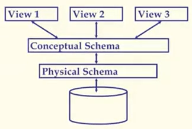

## 数据库原理与应用 第三讲 引言（三）

- 作者：__赵明心__        
- 日期：__2019年7月29日__
  
---

## 一、关系数据模型

关系数据模型早在1970年代就已经提出，直到今天仍然是最主流的数据模型，其核心数据结构是关系，也就是一张表，关系数据模型当中只有二维表这种数据结构，在这个数据结构中，每一行称为一个元组，每列称为一个属性。

关系数据模型今天被广泛使用：

- 主要概念：关系，基于表的行与列
- 每个关系有一个数据模式（schema），描述了表的列或域
  
## 二、数据的抽象级别

实际上在一个数据库系统当中，模式分为三级，分为物理模式、逻辑模式（概念模式），以及最顶层的View（视图，也成为外模式）

- 视图描述用户如何看到数据
- 概念模式定义了逻辑结构
- 物理模式定义了数据存储（索引）的结构，例如堆文件、哈希文件
  
  DBMS的三级模式

数据库系统的数据最终是以文件系统的文件形式存储在文件系统内的，所以物理模式确定了文件的存储格式，也即其物理结构。而概念模式则描述表的性质，是一种逻辑的描述。最上层的外模式是给最终用户看到的逻辑的样子。在概念模式当中的表称为基表，这个是跟物理模式一一对应的，而视图模式则未必和物理模式一一对应，例如在逻辑模式中存在100张表，而视图中对应于某个用户可能只可以看到10张表，对于不同的用户而言，他们可能看到的是逻辑模式的不同映射。

每个用户能看到的都不一定是数据库的全貌，有可能是逻辑模式的某种映射。

### 2.1 例子：高校数据库

- 概念模式：
  - 学生（sid：字符串，姓名：字符串，登录：字符串，年龄：整数，GPA：实数）
  - 课程（cid：字符串，课程名：字符串，学分数：整数）
  - 选课（sid：字符串，cid：字符串，分数：整数）
- 物理模式：
  - 以无序文件形式存储的关系（就是堆文件，未排序的）
  - 以学生的第一列为索引（在学号上建立B+树索引）
- 外部模式（视图模式）：
  - 课程信息（cid：字符串，选课数：整数） 

最后的外模式有可能就是教务处的管理人员看到的数据库的样子，他们不需要关心具体的选课的人是谁而需要关心每门课程都有多少人来选。但是这个选课数的信息在概念模式中并不存在，这个选课人数信息就是通过计算得到的映射。当我们对概念模式中的所有学生选课的课程id进行编号排序之后，就可以计算出每门课的选课人数，这个时候就可以得到外模式中的信息。

既然数据库存在三级模式，物理模式与概念模式之间存在存储方式之间的映射关系，在概念模式和外模式之间存在关系计算的映射。

### 2.2 数据独立性

由之前的例子引出了一个关键的概念：数据独立性。
- 应用独立于数据的结构和存储方式
- 逻辑数据独立性：保护应用程序不受数据的逻辑结构变化影响
- 物理数据独立性：保护应用程序不受数据的物理结构变化影响

这是使用DBMS最重要的好处之一。应用程序都是基于外模式开发的，对于某个特定用户而言，他的东西都是基于外模式的，例如对于选课人数属性，当逻辑模式中存在某个修改导致变化的时候，逻辑结构中的表变化了，这时只需要保证变化后的逻辑模式中的表能够保证映射结果不变，以至于视图不变化就可以保证在此基础之上开发的应用程序感受不到底层的变化。当然这种独立性也是有一定限度的，必须保证变化后的数据库仍然可以通过某种方式计算出原来的外模式。

还要注意的是，由于选课人数需要选课和课程都可以被索引，不然排序会变得非常困难，所以有可能一开始是堆文件存储，但随着需求的改变，需要使用哈希文件进行存储，这就需要改变物理模式，但这时也可以屏蔽物理模式变化对于应用程序的影响。

因此，使用数据库进行管理最重要的好处就是DBMS存在三级模式、两级映射从而支持数据的两级独立性，使用文件系统进行管理是没有这个便利的。

## 三、数据库技术发展的历史

从不同的方面对数据库进行分类从而考察其发展历史。由于数据模型是数据库的核心，那我们先按照数据模式来对数据库进行分类。

按照数据模型的发展：
- 无管理（1960年代之前）：科学计算
- 文件系统：简单数据管理
- 数据管理需求持续增加，DBMS出现：
  - 1964年，第一个DBMS（美国）：IDS，网状数据模型
  - 1969年，第一个商用DBMS，IBM，层级式数据模型
  - 1970年，E.F.Codd（IBM）提出了关系数据模型
  - 其他数据模型：面向对象、演绎、ER...

在1960年代之后出现了计算机的非数值应用，计算机不仅仅用于数值计算，还可以用来进行管理。在这些应用领域中，和科学计算不一样，需要对数据进行永久、长期保存，这时出现了操作系统，同时提供了文件系统，可以对文件进行管理，但此时的数据管理应用还是非常简单的。

关系数据模型中只有表，被管理数据都存储成表，用户使用的时候得到的查询结果还是表，从而构成了一个封闭的计算模式，这样就可以引入一个代数系统，从而建立关系代数。目前仍然没有新的数据模型能弥补关系数据模型的缺点。