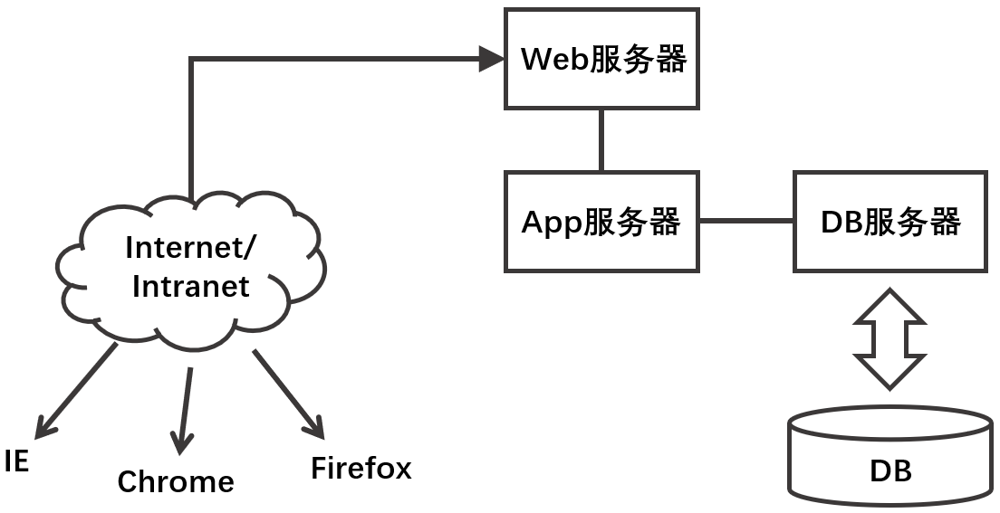

## 数据库原理与应用 第四讲 引言（四）

- 作者：__赵明心__
- 日期：__2019年7月30日__
  
---

## 三（续） 数据库技术的发展历史

### 3.2 从数据库结构看数据库结构的发展

早期，由中央主机和终端构成计算机系统的时候，DBMS集中式管理。随着计算机系统的发展，出现了多个主机的情况，在并行计算机的时候建立数据库的时候，数据库仍然是存储在其中一台主机上，只不过该主机具有多个CPU，能够并行处理数据，这个时期的DBMS在底层存储、查询优化上面做了很多改进。不过从存储的形式上，这个时期的数据库仍然是集中式存储的。在并行数据库的后期，随着局域网的发展，出现了分布式系统。

1970年代中后期，分布式系统出现，当时单台计算机的处理能力比较弱，有时候需要多台处理能力较弱的计算机组成一个计算网络，协调完成一个复杂的任务，使得这个系统达到一个中型机的能力。分布式计算技术的发展使得数据管理也出现了分布式需求，例如一个企业的数据库，由于数据量大、请求多，任何一个单台计算机都无法完成这些请求。这时开始对数据库进行分割，分布存储到网络中的多台计算机上面，对外呈现出一个完整数据库的样子。

联邦式数据库也是在研究分布式情形下的数据库，不过和一般的分布式数据库不太一样，联邦式数据库对异构数据库集成有帮助，每个节点的用户看到的数据库都是不一样的。其实是，近年来出现的移动式数据库，它可以让任何用户在任何地点获取数据库的信息。像现在的小米手机，一般处理主频都在1.几GHZ，现在智能手机和2000年前后的PC机能力已经差不多，能够处理相当复杂的操作，可以在掌上终端上面完成很多数据库的处理过程，从而脱离了传统信息系统的约束。数据存储（缓存）、与企业中心数据库进行同步、处理移动端的数据处理和查询都是移动式数据库关注的内容。

数据库是任何应用的基础和核心，那么还可以按照基于数据库的应用系统的发展来进行分类。在集中式管理的时代，只有主机和哑终端，哑终端只有显示器和键盘，没有处理能力，应用程序都跑在一个主机上。

- 集中式结构：主机-终端结构（Host-Terminal）
- 分布式结构：分布式数据库
- 客户端/服务器结构：出现于80年代初期的非常流行的结构
- 三层或多层体系结构
- 移动计算
- 网格计算/云计算

在局域网中联网的计算机，每台计算机都是地位平等的，每个节点都可能存储了一部分程序，但数据不一定完整，如果自己缺少一部分数据，这个时候就需要其他节点来提供服务。联网计算机之间没有主次之分，地位完全平等。

在客户端/服务器结构中，一般一个处理能力很强的主机来做数据库服务，在它上面只跑DBMS，而应用程序跑在客户机上面，联网计算机有了主次之分，应用程序通过网络对DB服务器进行查询请求，查询结果通过网络返回给客户端，这种结构直到今天仍然被大量使用，尤其是在企业数据管理中，仍然很多。

在多层体系结构中，前端往往就是一个浏览器，例如IE浏览器，用户通过IE提出访问信息系统的请求，IE通过网络（例如Internet）向Web服务器提出请求，而Web服务器判断浏览器的请求是不是一个功能性请求，当Web服务器发现请求是一个J2EE或者ASP应用请求（例如对JAVA对象的访问请求），这个时候Web服务器会将请求转向应用服务器，在应用服务器上面跑的都是一些应用服务，此时应用业务如果需要访问数据，就会像数据服务器提出请求，最后处理结果会以网页页面（例如html）的形式返回给WEB服务器，再返回到浏览器。

和传统的分布式结构、客户端/服务器结构相比，多层体系结构的特点一个是前端简单，只需要一个浏览器。而对于其他结构来说，前端可能需要是一个特定的应用程序，而多层体系结构直接借助互联网，使用网络服务请求来传递数据请求。正常的三层结构系统，应用系统都是跑在应用服务器上面，前端不需要很强，只需要跑一个浏览器就可以。以前Sun公司也有专门做一种计算机，只能用来跑浏览器，这样可以大大降低成本。采用多层结构的时候，客户端不需要安装应用程序，当客户的应用需求发生变化的时候，在BS架构下，只需要替换应用端的程序就可以，不需要替换所有客户端的业务模块。

不过多层结构由于多层转换可能存在效率的问题。采用BS结构还有一个好处是地理范围限制小，使用VPN的时候可以直接在外网对内网资源进行访问，而客户端/服务器模式下面，局域网中的资源无法对外提供服务。

现在客户端/服务器架构和BS结构使用的都很多，很多ERP管理的数据库产品两种使用模式都支持。