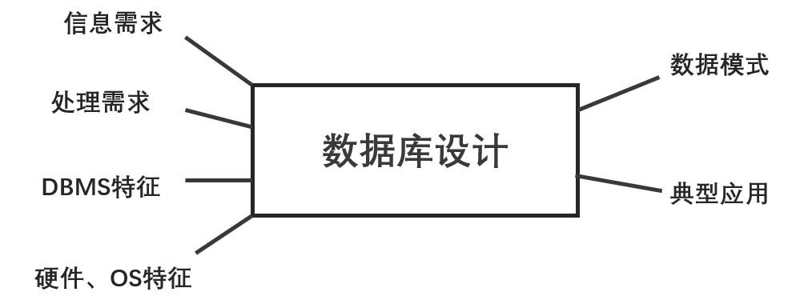

## 数据库原理与应用 第五讲 引言（五）

- 作者：__赵明心__
- 日期：__2019年7月30日__

---

## 三（续） 数据库技术的发展历史

98年前后随着移动互联网的发展出现了移动计算技术，也因此产生了移动数据库技术，使用户在移动终端处理数据。

现在比较热的还有网格计算和云计算，这都属于分布式计算技术，强调的都是虚拟化。简单地来说，网格技术是试图把全世界联网的计算机资源整合起来形成一个大型的虚拟计算机，Grid这个词来自于电力行业。早期的时候用户用电可能需要自己发电，随着技术的发展形成了社会分工，发电厂只管发电，电力公司负责电力配送，电力设备企业生产相关的电力设备，而用户只需要把电器插到插座就可以，不需要关心电具体来自什么电站。Grid就是一个复杂的配送网络，现在计算机都连接在互联网上，就可以形成一个虚拟计算机，按照理想情况，家里除了有电力接口还有一个计算力接口，计算力通过全球联网计算机实现服务，根据用户的计算量需求计费。

而云计算更多的是工业界从商业运行模式上面提出的概念，联网的计算机构成一个云，背后是巨大的计算环境。根据用户的计算请求来计费，亚马逊、IBM都有自己的云计算平台。亚马逊把My Base做成一个数据库服务。例如学生需要做一个生物信息方面的处理，需要一个大服务器来存储这些数据。这时导师可能没有那么多的经费来支持这样的数据存储，这时候可以向亚马逊提出申请，申请一个主机同时申请一个数据库请求。亚马逊对计算资源的申请进行组合，向学生提供My Base数据库的连接字，学生就可以像连接普通服务器一样使用云计算资源，这个服务比自己买一个服务器要便宜的多。等到学生做完了实验，就可以归还计算资源。

不过在归还计算资源的时候，计算的结果和一些数据可能也需要保存下来，亚马逊还提供了存储服务，允许把数据放到存储数据库上面，而这个存储数据库的价格是很低的。这个过程会比自己买一个服务器要便宜很多。在网格和云计算环境下，研究者主要研究如何有效的管理数据以及在这个环境下如何有效地进行应用的开发。

### 3. 从数据库的应用领域来看数据库技术的发展

- OLTP
- 工程数据库
- 演绎数据库
- 多媒体数据库
- 时态数据库
- 空间数据库
- 数据仓库与数据挖掘
- 知识管理
- ...
  
OLTP就是日常事务处理，就像在学校里学生选课、学生信息管理等等，这是数据库的传统服务领域。

如果把数据库用于工程设计类数据管理就是工程数据库，例如CAD制图数据等等，工程数据库可以用关系型数据库管理，也可以使用面向对象的数据库等等。在管理多媒体数据的时候对应就是多媒体数据库。时态数据库需要管理数据的时间信息，通常的数据库是没有关心时间的。例如在一个企业里，可能某个员工在某个月份的工资是多少，在之后某个时候工资标准发生了改变，一般的数据库无法对历史信息进行回答，而时态数据库则可以回答与时间信息相关的查询请求。而空间数据库需要管理空间物体信息，例如GIS数据库。数据仓库、数据挖掘领域是与OLTP相对应的，当企业中积累了大量的日常数据的时候，数据仓库和数据挖掘就可以从数据中发掘内在规律为企业的经营决策提供服务。

IBM现在推出了一个基于XML的引擎来提供知识管理的功能，例如企业内的技术文档、人员的技术积累与经验等等，都可以借助数据库管理，以便于后续的人员查询学习，这样构成了一个企业的知识积累。

## 四、数据库系统

- 应用程序+DBMS+数据库+DBA
- DBMS是数据库系统的核心
  - 高层次用户接口
  - 查询处理与优化
  - 目录管理
  - 并发控制与恢复
  - 完整性约束检查
  - 访问控制

上面的六点也是采用数据库管理系统的原因，SQL语言是一种接近于自然语言的高级语言，适合用户使用。采用关系型数据模型的一个重要原因还在于关系型数据解决了网状和层次模型所无法解决的查询优化问题。

在企业级数据库中经常有成千上万的用户并发访问，为及时响应用户请求，同时避免数据库一致性被破坏，就需要数据库提供并发控制与恢复机制。而访问控制则约束了只有合法用户才能对数据进行访问。现在开发信息系统无法离开数据库。

## 五、数据库系统的生命周期

数据库的生命周期分成了5个阶段：

1. 数据库系统规划
2. 数据库设计
3. 数据库建立与加载
4. 数据库的运行、管理与维护
5. 数据库扩展与重构

明确数据库的软硬件平台之后就可以进行数据库的设计，设计的时候需要确定数据模式，例如在采用关系型数据库的时候，需要确定采用多少张表、每张表需要记录什么信息。之后就可以建立运行数据库。随着数据库的使用，数据库中会产生很多垃圾，这时候需要DBA对数据库进行维护和清理。

不同数据库特点不同，需要考虑，例如MySQL和Oracle的特性不同。操作系统不同也会影响数据库系统的设计。

__第一张主要是介绍数据库系统的概貌、历史和基本概念，第一张内容到此结束。__