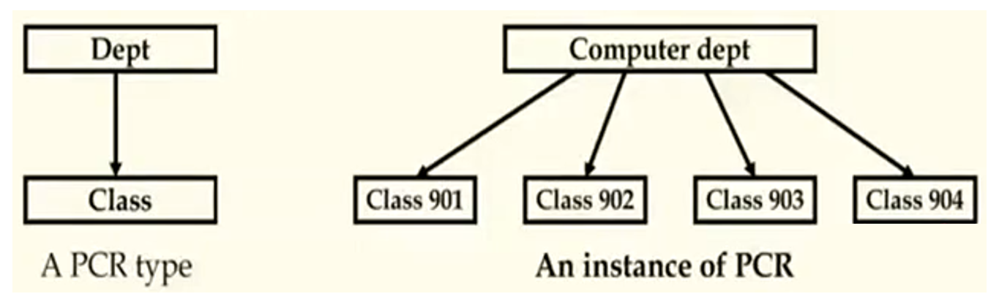
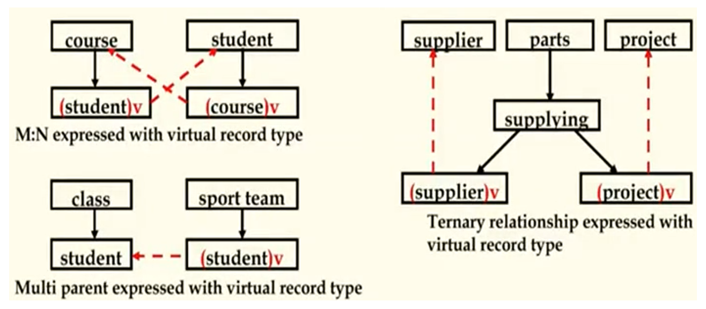

## 数据库原理与应用 第六讲 层次数据模型

- 作者：__赵明心__
- 日期：__2019年7月30日__

---

从本讲开始进入第二章部分，第二章是数据模型，是数据库课程的重点内容。

## 二（1）、层次数据模型

在现实世界当中，层次结构是非常常见的，例如学校的层级结构的安排，学校下面有各个处、再往下又有各个科室等等。层次模型就是试图去描述现实世界当中的这种树状层级结构。

- 记录（Record）和域（Field）
- 父子关系（PCR，Parent-Child Relationship）:层次数据模型中最基本的数据关系。它表述了两个记录类型之间1:N关系。

记录是现实世界中的实体，例如一个学生或者一个老师，每个记录都包含了若干个域。层次模型中，双亲子女关系表达了现实世界中一对多的关系。一个实体是一个记录，一类实体就是一种记录类型，PCR关系是两个记录类型之间的关系，例如学生和课程之间的关系就是1对多的关系，一个学生对应多个课程，同时一门课程对应多个学生。院系和班级之间也存在这种关系（实际这是一个多对多关系）。

在形式定义上，就是一种树形关系，在实际值的表现上就是一个系对应哪些具体的班级。

### 2.1.1 **层次数据模式**

- 一个层次数据模式包含了若干个PCR
- 每一个PCR表示了一个1:N关系
- 每一个记录类型只能包含一个祖先

一个记录类型存在多个双亲的话就不是树形结构了，这时数据结构所带来的限制。图中展示了形式上和数值上的层次数据模型。

### 2.1.2 **虚记录**

但是现实世界是丰富多彩的，并不是所有情况都能表达成这样的关系。有可能存在多对多的关系，例如一个学生选择多门课程。这个时候倒过来就不是树了。

- M：N关系存在于不同的记录类型中
- 一个记录类型是多于两个PCR的孩子
- N元关系

这时候引入了虚记录的概念（Virtual Record）。所谓虚记录就是一个指针，为了避免的数据的冗余，同时为了保持这种PCR关系，因此有了这种方式。虚记录当中存储的是指针指向真正的学生，它只是一个逻辑上的概念，一个学生选择了多门课程的时候，课程也是一个虚记录，虚记录指向了真正的课程。

从结构上来看，似乎是一个树形结构，但是从编程的角度看，由于存在一个指针指回来已经不能算作一个标准的树形结构。

## 二（2）、网状数据模型

- 网状数据模型的基本数据结构是“set”（系），一个系表达了一个真实世界中两个记录类型间的一对多关系。1这边称为主记录，多这边称为属记录。同一个记录类型可以同时是多个记录类型的主记录，也可以是多个记录类型的属记录。这样多种记录类型之间就可以交织成为网状结构，网状数据模型的名称就是因此而来。
- 它突破了层次模型的限制，不存在双亲的问题，可以比层次模型更加容易地表示现实世界
- Record和Data items：数据项和层次模型中的域是类似的，但是数据项可以是一个向量，也即可以是一个复合类型，在关系数据模型中记录类型必须是原子的，不能是复合类型
- 系：表达了两个记录类型的一对多关系
- LINK记录类型：表达多对多关系和N元关系

### 2.2.1 **网状数据模型的例子**

在网状数据模型中不再像层次模型是一棵树，而变成了一个链表。例如在班级和学生的关系（C-S系）上，在C-S系链表中，就有901班级记录，沿着记录的链表就可以找到这个班级的所有学生。

想要表达雇员记录类型（EMP），表达领导与被领导关系的时候就存在自己和自己连接的情况。在定义系的时候，不能表达主记录和属记录都是自己，这时候就需要一个LINK记录，这里可以定一个1对1关系，我们在这里称为S1，S1代表了某个领导的替代，与其他雇员发生关系，同时又借助S2使雇员与自己发生关系。这里面系的值还是需要借助链表来表达，每一个系型对应的值都是链表。

在EMP的实例中，可以看到L1作为Mary的替身，借助L1与其他Leo和Lin发生关联构成链表S1，L1就是链表的头，沿着L1可以顺着S2向下查找就可以找到每个员工的下属。在网状数据库中就形成了这样一圈一圈的搭建关系。在网状数据库当中，对数据进行查询就是不停地遍历链表。

在层次数据模型中，做查询就是遍历那棵树，例如查询计算机系中年龄大于20岁的学生就需要先遍历计算机系的树，然后查到学生属性，再判断学生的年龄是否大于20岁。所以无论是层次还是网状数据模型，在使用数据库和查询的时候都需要进行编程才能拿到自己需要的信息。