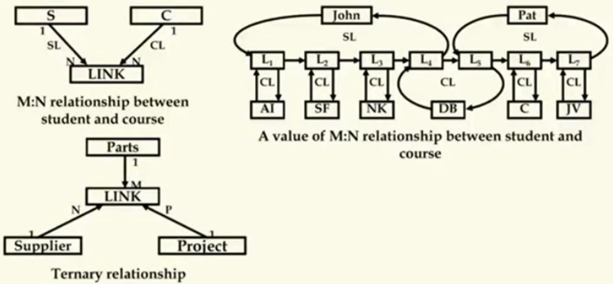
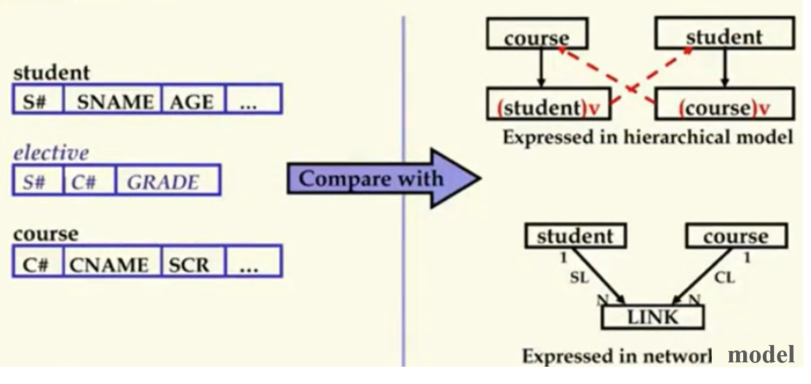

## 数据库原理与应用 第七讲 网状数据模型

- 作者：赵明心
- 日期：2019年7月30日
  
---

### **2.2.1 网状数据模型的例子（续）**

这是一个多对多的例子，其中AI表示人工智能，SF表示软件，NK表示网络，DB表示数据库，C表示C语言，JV表示JAVA语言。这个多对多关系是选课学生和课程之间的多对多关系。指针实际上是很麻烦的，不小心操作就会出错。为了表达现实世界的多对多关系，在层次模型中使用的是虚记录，在网状模型中使用的是LINK记录，由于一个set只能表达一个一对多的关系，这个时候需要两个系，引入一个LINK记录。两个一对多联系拼在一起就构成了多对多联系。

John出现了四个L表示选择了四门课程，有四个LINK记录。从学生Pat的角度再看可以看到Pat选择了L5\L6\L7三门课，通过遍历L5~L7链表就可以找到Pat具体选择的课程。

我们再从课程的角度考虑，从DB上出发去遍历链表的时候可以找到L4和L5，数据库这门课程可以看到链表上有两个人选了。而且从L4可以遍历到John，继而又找到L5~L7再找到Pat，发现第二个选课的人。

在网状数据模型中，数据库是一片数据的海洋，而程序员是领航员，通过程序员找到需要的数据，这说明网状数据库的使用需要清楚编程的很多知识，必须清晰的知道链表的操作和数据之间的关系。

同样的三元联系也是类似的，再多套一层链表实现三元联系。

**层次和网状数据模型不需要花费太多的时间去了解细节，不是这门课的重点，层次和网状数据库在现在已经不用了，课本当中还会讲解关于层次网状数据库如何在磁盘序列化的知识。**

## 二（3） 关系数据模型

在关系数据模型中，最基本的数据模型只有一个，就是Table（表），这个表和现实世界中表格的概念是基本一致的，只不过增加了一些约束。

> 基本数据类型是表，或称为关系，现实世界中的关系均被表达为表格，由此关系数据模型可以被严格数学化，这使得数据库技术被上升到理论的高度。

关系型数据模型特点：

- 基于集合论，高度抽象化
- 屏蔽所有底层细节、简单清晰、易于理解
- 能建立新的代数系统 —— **关系代数**
- 非过程式的查询语言 —— **SQL**
- **软连接** —— 与先前的数据模型的关键不同之处

关系型数据库的操作都是基于表的，是一个封闭的系统，因而满足定义集合的条件，从而构成一个数学系统，借助数学工具来进行研究。层次和网状数据模型都是纯粹的技术而没有深层次理论支持。关系模型可以很好的屏蔽底层的技术细节，没有树、指针、链表这种程序员才能理解的概念。表格是非常容易理解的，大多数人从小就会接触表格的概念，从成绩单到选课表都是表格。其次是非过程化的查询语言，实际上在早期的时候有各种各样的查询语言，只不过SQL在发展过程中逐渐成为了标准。

层次和网状数据模型的查询是过程化的，需要程序员指定如何遍历这个数据结构，如果检索数据，而SQL不需要指定这样的过程，只需要指定查询的要求。这对于用户来说是很友好的。

最后需要注意的概念是Soft link —— 软连接，在层次模型中，借助PCR表示连接，这些连接都是物理指针，记录的都是一些物理地址，我们称为硬指针，相对而言关系模型中，现实世界中联系称为软连接。下面通过一个例子讲解什么是软连接。

在关系模型中，表达多对多联系，只需要组一个选课的表就可以表达学生表和课程表的组合，借助选课表关联了课程表和学生表。在选课表中，学号属性相当于一个指针，只不过不是物理的指针，它是学号的值，通过这个值引用了学生表中的学生，我们可以视作一种逻辑指针。这些属性可以用来引用表中的具体信息，起到了指针的作用但又不是一个指针，所以关系数据模型借助这种属性的关系也实现了类似于虚记录或者LINK的功能，是一种连接，不是硬指针（非物理的）。