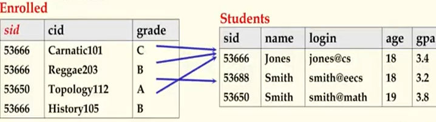

## 数据库原理与应用 第八讲 关系数据模型

- 作者：赵明心
- 日期：2019年7月31日

---

## 二（3） 关系数据模型（续）

### **2.3.1 关系数据模型的Attributes和Domain**

属性和域是用来描述表的模式的。

> 现实世界中一个实体的特征在关系数据模型中被表达为属性，例如一个学生可以被描述成具有“姓名、学号、性别、年龄、出生日期、国籍”等属性
> 属性的取值范围被称为域
> - 原子数据（Atomic Data） —— 1NF
> - 空（Null）

学号可能是长度为10的字符串，年龄是一个整型数，这样每个属性都会对应一定的取值范围。讲到属性和域需要注意的一个问题是，在关系数据模型当中，每个属性的取值范围需要满足两个要求，一个是原子性，每个属性都必须是基本数据类型，不能像结构体或者数组这种符合数据类型。用通俗的语言来表述就是不允许表中嵌套表格，一个表中嵌套别的表格虽然在现实中也可以称为表格，但是在关系数据模型中不允许这样（这意味着属性本身也是一个表）。这种要求是1范式的要求，也就是在任何关系数据模型中任何表都首先要满足是一个1范式的。再者就是允许某个属性是空值，空值是不知道，而不是空串或者0。例如一个学生在填写入学信息的时候忘记填写家庭住址这个属性，那么这个属性就是一个空的。

### **2.3.2 关系（Relation）与元组（Tuple）**

现实世界中的一个实体可以表述成一个或者多个关系（Relation）。

一个关系（Relation）是定义在它的所有属性域上的N元联系（Relationship）。

假定一个关系R具有属性A1、A2...An，对应的域为D1、D2...Dn，那么R可以表述成：
- $R=(A_1/d_1,A_2/D_2,...A_n/D_n)$
- or $R=(A_1,A_2,...A_n)$

关系型数据库设计的时候会具体讲解现实世界中的实体是在建表的时候建成一张表还是分解成多张表。一个关系可以理解成定义在所有属性值域上的N元联系，就像上面的$R$的例子。属性的个数$n$被称为关系的**目**。

刚才所说的$R$只是一个形式上的表述，具体的取值$r$是一个$n$元组，也可以表示为$r(R)$：
- $r={t_1,t_2,...t_m}$
- 每个元组$t$可以被表示为：
  - $t=<v_1,v_2,...v_n>,v_i\in D_i,1\le i \le n$
  - $t\in D_1\times D_2,... \times D_n,1\le i \le n$
  - $r\subset D_1\times D_2,... \times D_n,1\le i \le n$

通俗地，关系也可以被称为表，属性又可以被称为列，元组被称为行。行其实在层次模型中就是记录。每个域的具体取值可以组成一个表项，构成了一行。

以上的那些叉乘，就表示了各个属性域笛卡尔积形成的集合，每个项都是笛卡尔乘积集合中的元素。（笛卡尔乘积就是属性两两组合构成的）

### **2.3.3 主键 Primary Key**

> 一个属性集对于一个关系而言是一个**候选键**（**Candidate Key**），如果这个属性集能满足以下的条件：
> 1. 没有两个不同的元组可以在这组属性上具有相同的值
> 2. 且，对于此属性集的任意子集以上条件不成立

第二个条件实际上表述了这个属性集具有最小性，所以当第二个条件不成立的时候就是一个超键。

特别地，有以下几种情况：

- 如果候选键不满足第二个条件则被称为一个  **超键** **superkey**

- 如果对一个关系而言存在多于一个候选键，那么其中以一个候选键就可以被管理员(DBA)选作主键，而其他键被称为候补键（alternate key）

- 如果一个主键包含了一个关系的所有属性，那么它被称为全键（all key）

主键和候选键是可以唯一确定一个元组的。

### **2.3.4 外键 Foreign Key与引用完整性 Referential Integrity**

外键是指以一个关系的属性集被用来指向另外一个关系的元组。（必须对应于第二个关系的主键）这类似于逻辑指针。

例如，在选课表中，当我们用学号去引用学生表中的学生，用课程号去引用课程表中的课程的时候，学号、课程号在选课表中就是一个外键，要注意被引用的属性在另外两个表中都是主键。

这就是对应于之前的软连接的概念，软连接就是通过外键实现的。之后在讲述引用完整性的时候还会再详解外键的应用。

在程序设计语言中，我们知道指针是不可以置空的，例如90901学号指向一个学生，这个学生在学生表中必须存在。所以我们在创建选课表的时候增加约束，要求所有引用的学号所对应的学生必须存在的时候，就保证了指针不空，数据库会在插入元组的时候自动检查此约束，不满足则无法插入。如果对于所有的外键而言，都存在这种约束，那么我们就获得了引用完整性。