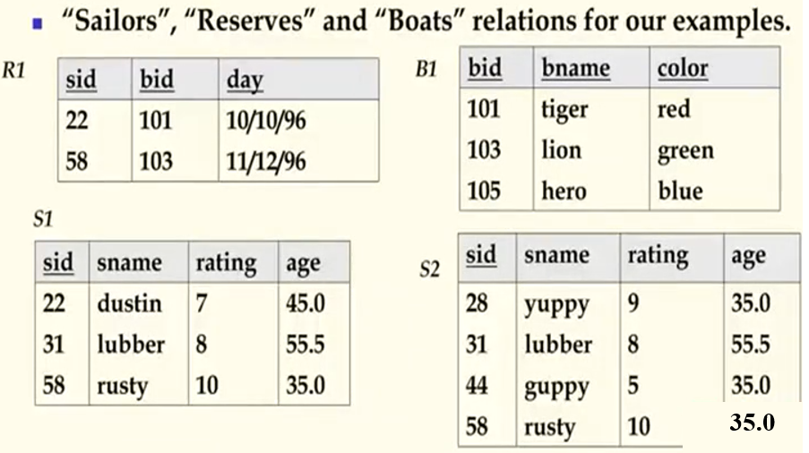
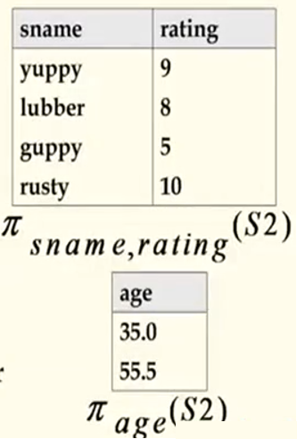

## 数据库原理与应用 第九讲 关系数据模型

- 作者：**赵明心**
- 日期：**2019年7月31日**

---

### **2.3.5 其他完整性约束**

通过外键实现的引用完整性约束是最重要的完整性约束，还有其他一些完整性约束。
- 域完整性约束（Domain）：一张表中的属性值都需要满足属性值定义的要求，例如整型值不可以插入浮点数
- 实体完整性约束（Entity Integrity Constraint）：一个关系中如果定义了主键的话，则主键属性不能为空。系统会自动进行主键的完整性，强制检查。

例子，之后的例子都是在这几张表上做的。水手和船之间是预定的关系，水手有级别、姓名、年龄属性，船有名称、颜色、编号属性，之后有预定表，表明水手和船的预定关系。

这个例子与选课的例子有相似之处，也有一些不同，注意预定表中，水手编号和船编号加在一起不是预定表的主键，因为一个水手可以多次预定一艘船，因此无法通过水手编号和船编号唯一确定预定表中的一项，预定表就是一个全键才可以检索的表。

## 二（4） 关系代数

关系代数中有五个基本操作，任何数据库只要支持这五个基本操作，那我们就称它是关系完备的，任何其他关系操作都可以由五种基本操作导出。
- 基本操作：
  - 选择（Selection，$\sigma$）：从关系中选择行的子集
  - 投影（Projection，$\pi$）：从关系中删除不想要的列
  - 叉乘（Cross-Production，$\times$）：允许我们组合两个关系(拼接两个关系，笛卡尔乘积)
  - 集合差（Set-difference，$-$）：$A-B$，是找到属于关系$A$但不属于关系$B$的元组的操作
  - 并集（Union，$\cup$）：模式相同的关系的元组的合并
- $\{\sigma,\pi,\cup,-,\times\}$是一个完整的操作集，任何其他的关系代数操作都可以从他们衍生出来
- 加性操作：
  - 交集（Intersection）、连接（Join）、除法（division）、外连接（outer join）、外并（outer union）
- 关系代数中的运算结果还是关系，这样操作之间可以组合嵌套。

### **2.4.1 投影**

- 删除不在投影表中的属性
- 结果的数据模式精确包含投影表中的域，与输入关系具有相同的名称
- 投影操作必须去重
  - 注意：现实系统一般不做去重操作，除非用户显式指定要去重

投影操作结果关系的模式就是运算符的属性列表中的属性，属性名和类型与输入关系名称相同。（注意模式就是运算结果）。在上面的例子中，向年龄投影的时候会出现重复元组，实际只存在35和55两种，所以需要去掉重复。由于在关系模型中出现两条元组具有完全相同的属性值，那我们认为它表达的是同一个实体，重复的实体是没有意义的，所以需要去掉重复。

从关系代数的理论上去重是必要的，但是数据库产品一般不会主动去重。这是出于用户需求角度考虑的，数据库开发者并不知道用户未来具体有哪些具体要求，例如当我们要计算所有水手的平均年龄的时候，投影到年龄的时候就无法计算平均年龄了，所以不能主动消除重复元组。

### **2.4.2 选择**

- 选择操作选择满足选择条件（selection condition）的行（rows）
- 结果是无重复的
- 运算结果的数据模式与输入关系相同
- 结果关系可以做为其他关系代数的输入

选择操作本身在结果中不会产生重复元组，因为选择操作只是在原始输入上做选择，原关系没有重复元组，选择结果也没有重复。选择操作可以继续进行符合。上例中，就是查找级别大于8的水手的姓名和级别，就可以使用以上操作来实现查询。

### **2.4.3 二元操作：并、交、差**

- 所有二元操作都接受两个关系作为输入，两个输入关系必须满足**并兼容**的条件
  - 属性的个数相同
  - 对应属性具有相同的类型
- 结果的模式（schema）如何？

