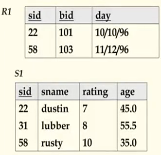
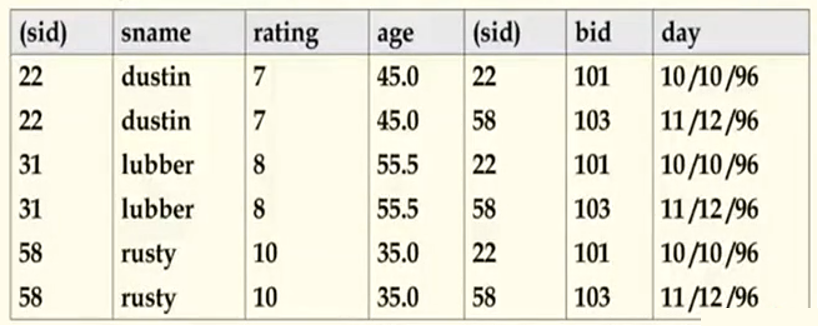
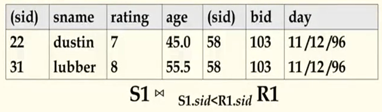

## 数据库原理与应用 第十讲 关系代数

- 作者：**赵明心**
- 日期：**2019年7月31日**
  
--- 

### **2.4.4 笛卡尔乘积**

- $S_1$的每一行和$R_1$的每一行之间进行两两拼接
- 结果模式包含了两张表的所有属性，属性名在可继承的情况下直接继承
  - 冲突：$S_1$和$R_1$均包含了属性sid
  - 重命名操作：将1重命名为sid1，将5号属性重命名为sid2
    - $\rho(C(1\rightarrow sid1,5\rightarrow sid2)),S1\times R1$

笛卡尔乘积和集合中的笛卡尔乘积是一样的。举一个例子，水手、船、预定表，两种不同的表做笛卡尔乘积其结果是拼接成一张大表，笛卡尔乘积的结果元组是输入表的元组两两拼接组成的。例如当$S1$和$R1$拼接的时候，属性个数就是两张表的属性总数，一共包含3+4=7个属性，元组数目是两张表两两组合，共$2\times 3=6$项。

 
笛卡尔乘积的结果存在很多没有意义的元组，在日常应用中，更有意义的是连接操作，两两拼接有很多无意义的。

### **2.4.5 Join 连接操作**

- 条件连接：Condition Join: $R\Join_C S=\sigma_C (R\times S)$
- 结果模式和笛卡尔乘积的模式相同
- 连接操作的结果比笛卡尔乘积更少，运算更高效（具体在查询优化的时候会详细讲解）
- 这种操作有时候也称为 *theta连接*

在R\S笛卡尔乘积的基础之上借助条件C进行选择操作，笛卡尔乘积和选择操作的组合就可以实现连接。 

- 等值连接(equi join)
- 与条件连接不同的是，两个等值的列会去掉其中一列
- 自然连接(natural join)：在所有的公共属性上都做等值连接就是自然连接，自然连接是应用开发的时候使用的最多的，之后讲解SQL例子的时候使用的基本都是自然连接

由join操作引申的操作还有等值连接，这是针对的条件C。条件连接的条件C可以是任意条件，但如果是相等判断的话，那就是等值连接。写法：$S1\Join_{sid}R1$表示在sid属性上对S1和R1进行等值连接。

### **2.4.6 Division 除法操作**

- 除法操作不是原生的关系代数运算符，但是对表达以下形式的查询很有用：
  - 查找预定了所有船的水手
- A包含两个域x和y，B只包含一个域y：
  - $A/B=\{<x>| \exists <x,y>\in A, \forall <y>\in B \}$，关系A中所有x属性值组成，满足关系B中任意一个y值，在关系A中都存在一个<x,y>值。换句话来讲，A除以B值就是A中元组和B都有联系的x值。
- 一般来说，x和y可以是任意属性的列表，也即x和y可能是属性集合，未必是一个属性。

例子：见下一讲

