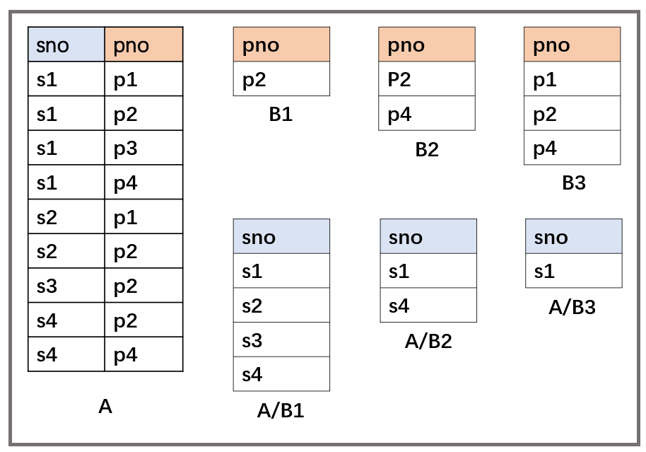

## 数据库原理与应用 第十一讲 关系代数

- 作者：**赵明心**
- 日期：**2019年7月31日**

--- 

### **2.4.6 Division 除法操作（续）**

一般的数据库产品并不提供除法操作，需要我们自行实现，那么可以借助关系代数基本运算来推出除法。

- 除法不是最重要的运算符，只是一个很有用的工具
  - 对连接操作来说也是的，但连接操作在数据库产品中一般都有实现
- 思路：对于$A/B$，计算所有x值**不是不合格的**对在B中的y值
- 那我们可以先找到不满足条件的y值，这个时候再去掉不满足除法条件的x，这时候剩下的就是满足条件的x
  - 不满足除法条件的x就是存在一个B中的y值，使得x和y拼接之后不在A当中
  - $\pi_x((\pi_x(A)\times B)-A)$，关键就是 ***先查找不满足除法条件的x值***，先笛卡尔乘积将A中的x与B进行拼接，由此得到的是一个完整的联系，这时候再减掉A，就会把满足除法条件的x都减掉了。剩下的结果是不满足除法条件的x值和y的拼接，最后再投影就得到了不满足除法条件的x值。
  - $A/B$就是$A/B=\pi_x(A)-\pi_x(\pi_x(A)\times B-A)$，这就实现了除法，总共使用了6个操作

### **2.4.7 外连接 outer join**

在后续课程中，如果不加说明，**连接都是指自然连接**。一般的连接都是满足公共属性值相等的元素拼接，但是有时候会存在不相等的，实际情况中，有时需要保留不满足等值连接的元组。这时候需要外连接。

- 左外连接：$*\Join$。连接运算符左边的操作数元组全部保留，能匹配就匹配，不能匹配在右边补空值
- 右外连接：$\Join *$。与之前类似，不过是在左边补空值
- 全外连接：$*\Join*$。两侧补空值

外连接的例子。

### **2.4.8 外并 outer union**

做并交叉操作的关系要满足并兼容条件，但是实际应用中，需要对不满足并兼容条件的关系进行强行合并，所谓外并操作就是对不满足并兼容的两个关系进行合并操作。

- 结果属性集是参与运算的两个关系的属性的并，类似于笛卡尔乘积
- 左右属性补空值

以上介绍的关系代数，是建立在关系模型上的一套代数系统，除此之外还有另外一套在关系模型上的查询方法，那就是关系演算。

## 二（五） 关系演算

关系代数是一个过程化的查询方式，需要知道先做什么、后做什么的查询方式。关系演算是一种不需要知道过程的查询方式，一种基于谓词逻辑的方法。