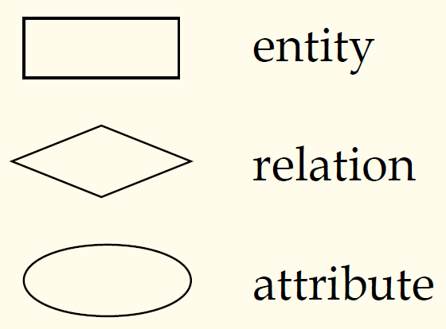
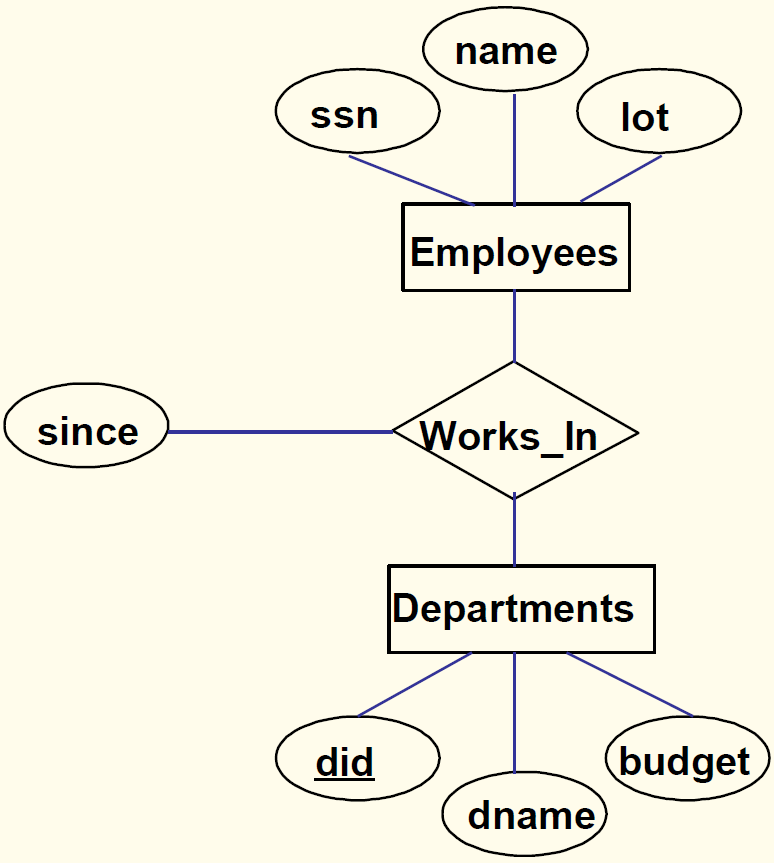
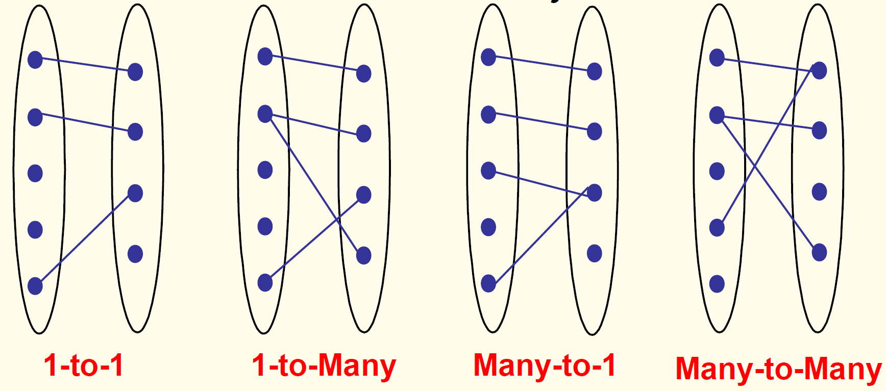
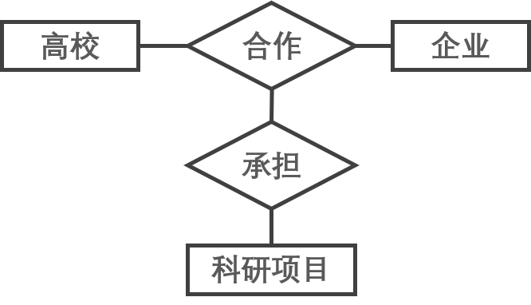

## 数据库原理与应用 第十四讲 ER数据模型

- 作者：**赵明心**
- 日期：**2019年8月1日**

---

### **2.9.2 ER图**

ER图在关系数据模型的概念设计阶段有很大作用。在ER图当中，有几个图例：

在数据库的概念设计阶段，利用ER图可以方便的与客户进行交流和讨论。长方形框表示实体集，菱形框表示联系集，椭圆框表示实体或者联系的属性（一般从实体或者联系上连出来一个椭圆框）。

did下面的一横表示该属性是一个主键，works_in关系表示雇员在某个部门工作，since表示雇员从什么时候开始工作。这个图非常直观，能表达的信息比传统数据模型更加丰富，ER图可以表示非常丰富的语义。如果在设计时期不留下详细的文档，关系型数据库是很难理解的，但是ER图可以直接看到很多信息。

### **2.9.3 基数比约束**

- 联系可以表示成1：1和1：N以及M：N。这被称为基数比约束。

- 例如一个雇员可以工作在多个部门，一个部门可以拥有多个雇员。这就是一个M:N。相对地，每个部门至多只有一个雇员或者经理能称为这个部门的管理者，这是1：1。

### **2.9.4 参与度约束 Participation Constraints**

基数比约束完全看实际应用中的情况。参与度约束在ER图中进一步规定了某个实体参与联系的最小和最大次数

- 规定实体参与联系的最小和最大次数
- 如果每个部门必须有一个经理，那么我们就称部门在管理关系中是 ***全参与*** ，反之就是部分参与，部门实体的最小参与度就是1。
- 另一个例子：学生选课的时候如果规定每个学生至少选3门至多选6门，那么学生实体在选课关系中的参与度就是$(3,6)$

可以把这些信息都标注在ER图上。此时的ER图就包含了更多的语义信息。

### **2.9.5 ER模型的高级话题**

这是在基本的ER模型上面扩展出的概念。
- 弱实体（Weak Entity），它不能单独存在，必须要依赖于其他的实体存在。例如在一个单位中存在一个职工实体集，然后有一个家属实体集。家属实体集就是一个弱实体，家属需要依赖于职工存在，东南大学的某个职工家属之所以是家属是因为存在一个在东南大学工作的员工。
- 普遍化和特殊化（Specialization and Generalization）
  - 类似于面向对象中的父类和子类，普遍化是父类，特殊化就是子类。研究生是特殊化，学生是普遍化。
- 聚集（Aggregation），允许将实体集中的联系再视作一种实体。举例，高等院校和企业各自是一个实体，高校和企业之间可能存在合作关系，而且是多对多关系，这个时候可以将高校和企业之间的合作看作是一个实体集，再去联系其他的实体。例如高校和企业的合作作为实体集申报一个项目。

- 范畴（Category），允许我们表达一个实体集包含不同类型的实体。是一个混合实体集（杂种集合，面向对象中的称呼）。举例：在银行账户当中，存在企业账户、个人账户，私人账户、对公账户，银行业务进行管理的时候尽管这些账户不是同一个实体集，但又存在很多类似的地方，这个时候就可以定义一个范畴，组成一个杂种集合进行管理。

ER模型的基础上面加上这些扩展话题，可以发现ER模型是表达能力相当强大的工具。很多常见的数据库设计工具就是基于扩展ER模型的，先借助扩展ER模型设计，再生成关系数据模型。

## 二（10） 面向对象数据模型

- 关系数据模型存在不足
- 突破1范式（相比关系数据模型的最大不同，属性可以非原子性，允许复合）
- 面向对象的分析和编程方法（需求分析和程序设计，OOA中使用面向对象的方式抽象类，然后用OO语言来设计和实现）
- C++等早期的面向对象语言，一开始要解决的是对象的存储问题，而面向对象数据库也是要实现对对象的永久存储，在未来需要的时候重新找到对象并快速加载到内存当中。以前有个Object Store，就和C++紧密联系，能将对象存储下来，在需要的时候再加载回来。少量对象可以使用对象序列化的方法使用文件系统方式进行管理，但是大量对象的情况下，就需要专门工具，例如Object Store这种和C++编译器紧密结合的工具来访问对象。但是这种工具强烈依赖与C++编译器，后来才出现了纯粹的面向对象数据库，可以摆脱对特定语言的依赖。尽管面向对象数据库有很多产品和原型，实际后来没有成功，关系模型现在仍然是主流，面向对象只在一些专用系统中使用。
- Object-Relation DBMS 面向对象关系型数据库，是比纯面向对象数据库更多的，它允许用户自定义抽象数据类型，也仅此而已。从严格的面向对象的角度来看还算不上是OO的。实际应用中，我们用的还是Oracle和DB2的关系型数据的那部分功能。
- Native(pure) Object-Oriented DBMS CA公司的茉莉花系统，是纯面向对象的数据库。
