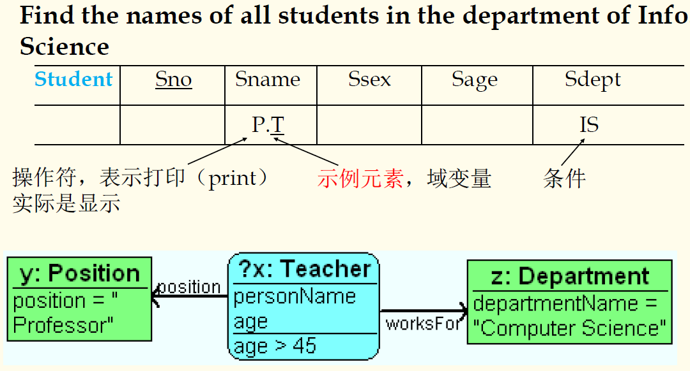

## 数据库原理与应用 第十五讲 数据库用户接口

- 作者：**赵明心**
- 日期：**2019年8月2日**

---

### **2.10.1** 其他数据模型

- 基于逻辑的数据模型（演绎DBMS）
  - 扩展DBMS的查询函数（尤其是递归查询函数）
  - 增强DBMS的演绎能力
- 时态数据模型
- 空间数据模型
- XML数据模型
  - 在互联网上存储数据
  - 普遍的数据交换标准
  - 信息系统集成
  - 表达半结构化数据
  - ...
- 其他

递归查询功能在SQL中也进行了扩展，逻辑数据模型还希望提升推理能力，也即希望根据用户的查询请求推理出数据库中未存储的一些信息。时态数据模型，在普通的DBMS中，当使用Update语句更新一个员工的收入时，他之前的收入信息就没有了，如果要查询一个员工的年度平均工资就无法做到。空间数据模型也是这样的，希望能更好表达空间物体之间的关系。XML是可扩展的标记语言，尤其是在互联网和电子商务中非常常见，可以作为不同应用之间交换数据，也可以作为异构系统集成时一种标准的中间数据格式，而从DBMS角度来看，可以将XML视作一种数据模型。现在分为两种，一种是原生的XML数据库，即数据的存储本身就是XML，另一种是XML Enabled DBMS，现在的数据库基本都是XML Enabled，可以将自己存储的数据导出成XML格式。

## 二（11） 总结

- 每种DBMS必须实现或支持某种数据模型，数据模型是DBMS的核心。
- 一个数据模型是一种方法论，对现实世界在DBMS的建模
- 事实上，任何数据库都要至少实现一个数据模型

是否存在一个数据模型能替代关系模型并获得流行？至少在可见的时间内，关系模型很难被取代。

## 三 用户接口和SQL语言（重点）

- 一个DBMS必须提供一些接口来支持用户访问数据库，包括
  - 查询语言，数据库都需要提供的
  - 接口和维护工具（GUI），尤其是在win平台上，需要图形界面，方便访问和维护，例如在Access可以直接访问数据库中的表
  - APIs，以上两个接口一般都是一种即时访问和交互的，APIs一般是在应用程序和编程层面的访问接口，在程序中访问数据库需要有一些编程接口，典型的是ODBC等库函数接口
  - Class库（类库，针对JAVA、C++等面向对象语言而提供的类库接口）
  
- 查询语言（是核心）
  - 基本的形式化查询语言（SQL就是形式化查询语言）
  - 表格式查询语言（以填表的方式描述查询请求，例如QBE查询语言，Query by Example，不需要查文法，只需要填表格，ACCESS中有类似的工具）
  - 图形化查询语言（目的和表格查询一样，都是希望用户不需要记忆SQL的命令）
  - 受限自然语言查询（早期的NITDB，就是向用户提供一个接近自然语言的查询接口，系统翻译查询语句）

## 三（1） 关系型查询语言

- 查询语言：允许在数据库中操作和检索数据
- 关系模型支持简单和有效的查询语言
  - 强大建立在逻辑上形式化基础
  - 允许多种优化
- 查询语言不等于编程语言
  - 查询语言不期望达到图灵完备
  - 查询语言不打算被用作复杂的计算
  - 查询语言支持简单有效地对大数据库的访问

注意查询语言不图灵完备，没有编程能力。

### **3.1.1** 形式化关系查询语言

- 两种数学化的查询语言为真实语言（例如SQL）的基础
  - 关系代数，过程化的描述
  - 关系演算，用公式描述结果应该满足的条件
- 最成功的关系数据库语言 —— SQL，SQL是非过程化的查询语言，借助系统的查询优化来对查询请求进行分解到基本的数学化查询语言，SQL原指Structured Query Language，后来又改名Standard Query Language（标准化查询语言，还是简称SQL）。

SQL语言又可以细分成四个子语言。

#### **SQL语言**

- 它可以按照功能被分成四个部分：
  - 数据定义语言（DDL，Data Definition Language），用来定义、删除或者替代数据模式
  - 查询语言（QL），用来检索数据（select\order）
  - 数据操作语言（DML，Data Manipulation Language），用来插入、删除和更新数据（insert\delete\update）
  - 数据控制语言（DCL，Data Control Language），用来控制用户访问数据的权限，例如授权、创建用户、完整性约束
- QL和DML在本章节将详细介绍。

QL语言实际上就是SELECT语句以及其中的子句，它是用来表达查询需求的。DCL在第五章完整性约束出现，DDL比较简单，不专门介绍。现代数据库中维护数据模式一般都是借助工具来实现，很少直接使用DDL来实现。