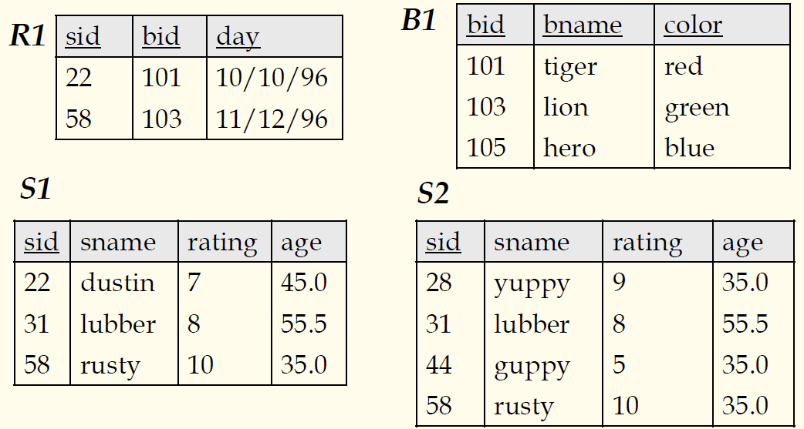

## 数据库原理与应用 第十六讲 SQL语言

#### **重要术语和概念**

- 基表（就是模型中所说的关系，基表是实实在在存在磁盘上的关系）
- 视图（数据库的外模式，是一个虚表，是用户看到的关系，是根据实际应用中根据需要使用计算和映射得到的，并不真实存储在磁盘上）
- 数据类型（关系数据库产品很多，但是每个具体的数据库产品支持的数据类型还是有差异的，例如整型数在一些系统中可以分成短整型、长整型、有符号、无符号）
- NULL（空值，在SQL中专门的保留字，也是关键字，引入空值之后二值逻辑变成三值逻辑，真假、不知道）
- UNIQUE（保留字，用于定义数据库中创建表的时候，来说明表格中的某个属性是否允许出现重复值，如果说明了是UNIQUE，那么这个属性就不可以重复，这个和主键还有区别，一张表中主键只有一个，如果一张表中多个属性值都不允许重复，就可以用UNIQUE，但它们不是主键）
- DEFAULT（指定缺省值，如果值在创建的时候未指定，就会使用缺省值）
- PRIMARY KEY（主键，指定主键）
- FOREIGN KEY（外键，指定一个外键，同时系统会检查引用完整性约束）
- CHECK（完整性约束检查，在定义一张表的时候，例如有一个属性年龄需要检查，那么创建学生表的时候就可以使用CHECK子句定义约束条件，未来在对学生表进行插删改操作的时候会自动检查年龄属性是否满足要求）

继续以上述表格作为例子，预定表的主键是全键，必须所有属性才能确定其中的一项。

#### **基本的SQL查询**

<!-- | --- | --- | -->
| SQL语句 | 参数 |
| --- | --- |
| SELECT | \[DISTINCT\] target-list |
| FROM | relation-list |
| WHERE |   qualification |

- relation-list：一个关系名的列表（可能在每个名称后面会跟随一段变量范围），DISTINCT是可选项，当增加此项的时候查询结果会消除重复的元组，默认情况下不会去掉重复
- target-list：一个关系的属性的列表（关系在之前的relation-list中）
- qualification：使用 **AND,OR和NOT**的比较

如果出现重复对查询语义有影响的时候，就需要添加DISTINCT。

#### **概念上的执行策略**

数据库语句是如何执行的呢？这里是概念上的介绍，真正数据库产品实现的时候不是这样死板的实现的，实际数据库系统都会根据数据库中数据的情况选择更高效地存取方式，现在并不影响理解。

- 一条SQL查询的语义按照以下**概念执行策略**定义
  - 计算关系列表的笛卡尔积（compute cross-product of relation-list）
  - 舍弃结果元组中不满足条件的元组（discard resulting tuples if they fail qualification）
  - 删除不在目标列表中的属性（delete attributes that are not in target-list）
  - 如果DISTINCE被指定，则消除重复
- 这种策略可能是计算一个查询最低效的实现方式。优化器可以实现寻找更优化、高效的查询策略。以上第一步就是拼接一张大表，之后剔除不满足要求的结果。后面在讲解查询优化的时候再讲解具体的优化策略，现在可以先这样理解。