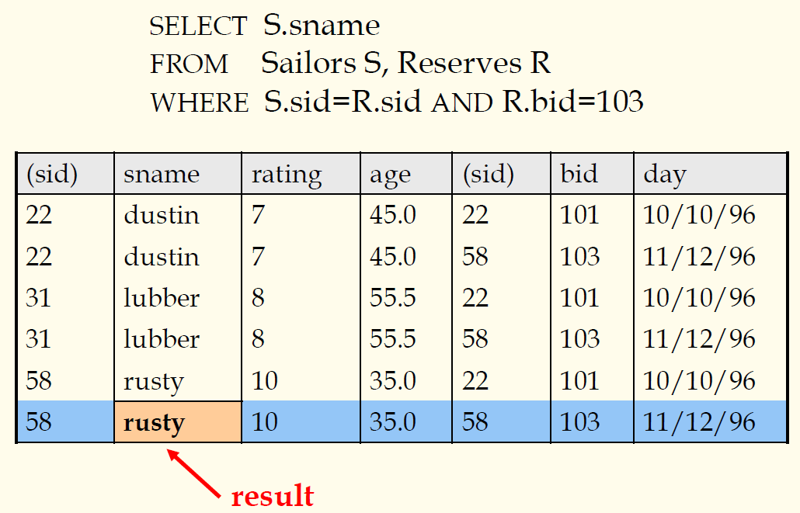
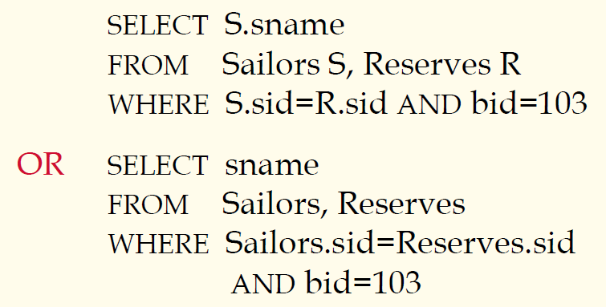
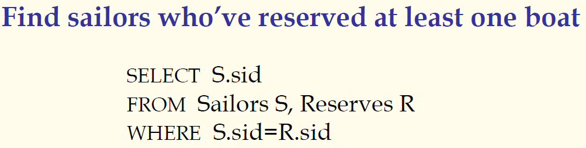
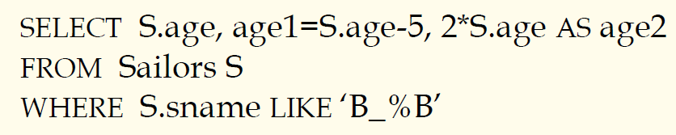

## 数据库原理与应用 第十七讲 SQL查询语言

- 作者：**赵明心**
- 日期：**2019年8月2日**

---

#### **简单的SQL查询例子**

注意这样在概念上执行的话，会存在很多没有用的数据，实际我们先按照bid对R扫描，之后再去查询S表，不会产生很多没有意义的数据，真正数据库会做很多优化操作。

#### **别名问题：范围变量**

- 在FROM语句中重复出现了两次的时候可以定义别名，使查询语句更加简单：

在上面的例子中给Sailors起了个别名S，又给Reserve起了名字R。但是在不引起混淆的情况下，可以不使用前面的前缀。例如第一种表示中的bid属性，实际上bid只存在于R表当中，即便是只写bid也不会引起混淆，或者根本不使用别名，直接按照第二种写法也是正确的。sname属性只存在于Sailors表，不在Reserves表中。

尽管在不引起混淆的情况下，省略表名称是可以的，但是建议使用别名，尽量规范地指定表的名称，这样可以提高可读性。

#### **例子**

查找至少预定过一条船的水手。实际只需要对reserves表格向sid投影就可以，但也可以直接写两个表的连接。如果只需要查询编号的话，不需要连接。但是要注意sname可能会发生重名，一定要注意不要随随便便写查询语句，该不该加DISTINCT是需要考虑的，有时候就需要sid,sname再加DISTINCT，而不是简单的对sname进行DISTINCT。

#### **表达式和字符串**

- 在SQL中支持LIKE表达的模糊查询，用“\_”表示匹配任意一个字符，用“%”表示匹配任意0到多个字符，在ACCESS中使用“？”表示匹配任意一个字符，“*”匹配任意多个字符。“B\_%B”表示至少三个字母长度匹配前后都是B的名字。此例要查询年龄，同时对年龄进行减5操作和乘2操作。
- 年龄乘以2并将结果赋给age2，使用了As语句。或者直接使用赋值语句“=”。