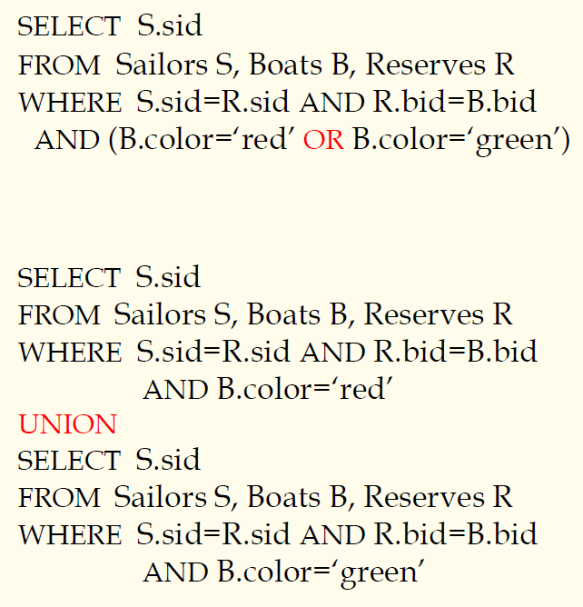
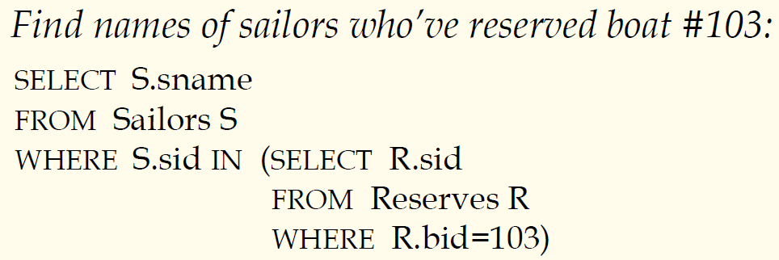

## 数据库原理与应用 第十八讲 SQL语言基于集合操作的查询

- 作者：**赵明心**
- 日期：**2019年8月3日**

---

### **3.1.2 基于集合操作的查询**

尽管在上面的例子中可以使用As和等于号来进行变量命名，但是具体的数据库产品不一定支持，ACCESS不支持As的用法。

本节需要学习三种语句:UNION、INTERSECT、EXCEPT。

### **3.1.3 嵌套子查询**

- 非常有效的SQL语言特性，WHERE子句可以包含一个SQL查询（FROM与HAVING子句类似）
- 可以类比于循环嵌套对嵌套查询进行理解