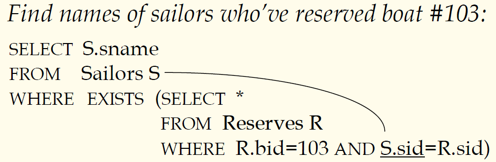
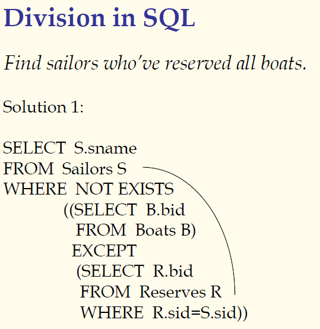

## 数据库原理与应用 第十九讲 基于嵌套子查询的查询语句

- 作者：**赵明心**
- 日期：**2019年8月4日**

---

### **3.1.3 嵌套子查询（续）**

- EXISTS 是一个类似 IN 的集合比较语句，但是以上的写法实际上比非关联的方式效率低，因为每个sid都需要进行一次比较。而之前的非关联嵌套，两个查询相互独立，内查询只需要执行一次即可。
- 在这个例子中，子查询需要对每个Sailors元组进行重复计算
- 如何查询预定过103号船且只预定过一次的水手名字？此处需要使用NOT EXISTS。

### **3.1.4 更多的集合比较操作**

- 除了IN、EXISTS和UNIQUE之外还有NOT IN、NOT EXISTS和NOT UNIQUE。
- 还有op ANY,op ALL,op IN $<,>,=,\leq,\geq,\neq$(op可以是后面运算符中的任意一个)，但是这些并不是所有数据库产品都支持的，需要看具体的数据库产品。
- 查找级别大于Horatio水手级别的水手

#### **几个查询的例子**

### **3.1.5 除法操作**

想查找所有什么什么的时候，一般都需要使用除法，在SQL中如何表示除法概念呢？

现在嵌套子查询中查找没有一条船是没订过的船的编号，先找到所有的船，再找到该水手预定的船，如果该水手没有没订过的船，则他订过了所有的船。

