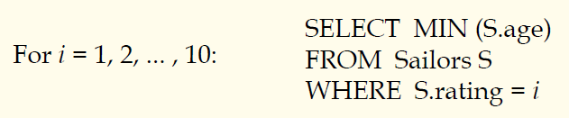
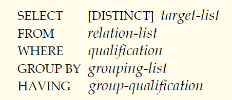

## 数据库原理与应用 第二十讲 SQL中的除法与聚集函数计算

- 作者：**赵明心**
- 日期：**2019年8月4日**

--- 

### **3.1.5 除法操作（续）**

如果不允许使用EXCEPT操作还能怎么实现刚才的查询呢？可以使用EXISTS存在量词来做。

### **3.1.6 聚集函数运算**

SQL提供了5个运算，帮助在数据库中进行统计运算。

- COUNT(*)
- COUNT(\[DISTINCT\] A)，计算A有多少个属性值，DISTINCT是多少个不同的值
- SUM(\[DISTINCT\] A)，对所有元组A属性上进行求和
- AVG(\[DISTINCT\] A)
- MAX(A)
- MIN(A)

注意：A是某张表上面单个的属性。

#### **聚集函数的例子**

如果查找最老的水手的姓名，那么第一个问题是最老的水手的年龄还不知道，第一种写法是错误的，S.sname是无法跟年龄的最大值对应的。查询的正确写法应该需要借助嵌套子查询，先计算最老的水手的年龄。在外层查询中再使用年龄条件。注意第三种写法在某些数据库中是不支持的，在应用开发编程的时候需要注意这个问题。

#### **分组聚集函数 GROUP BY**

- 目前为止，我们已经把聚集函数应用在了所有的元组上面。当实际应用中，可能遇到更复杂的需求，需要把聚集函数应用在某些元组的分组上面。
- 考虑：找到每个级别下面年龄最年轻的水手的年龄
  - 通常，我们不知道存在多少个级别以及这些级别对应的级别值
  - 假如我们知道级别一共有1~10，我们可以写10个查询

注意SQL是查询语言，FOR循环实现不了，这个时候就需要分组函数。

#### **带分组和HAVING的查询**

分组运算，SELECT语句进行扩充，这样一个完整的SELECT语句通用框架就有了。增加GROUP BY子句和HAVING子句。

