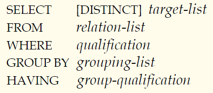
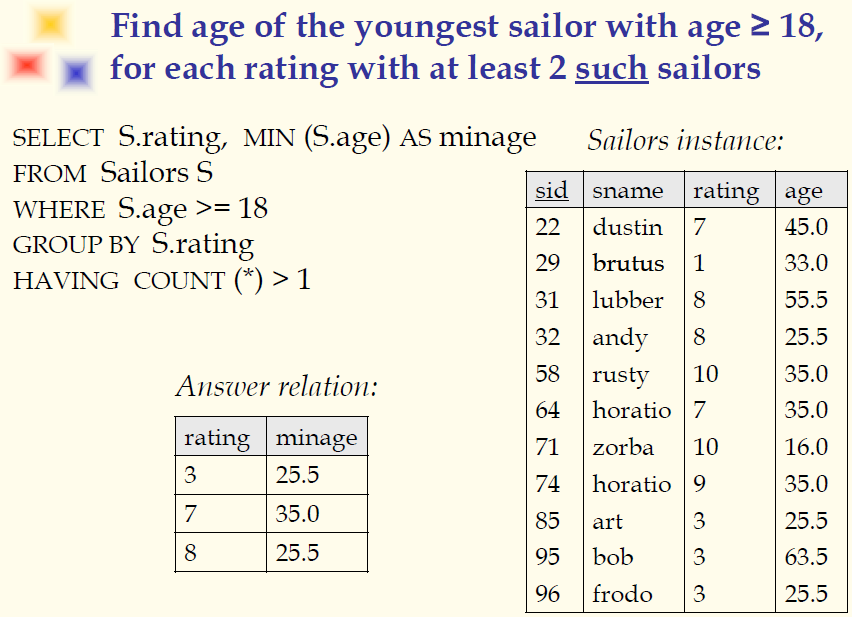

## 数据库原理与应用 第二十一讲 

- 作者：**赵明心**
- 日期：**2019年8月5日**

---

#### **带分组和HAVING的查询**

HAVING子句对组进行筛选，GROUP BY子句可以借助HAVING子句对得到的组进行条件筛选，WHERE子句是对元组进行筛选。那么增加了GROUP BY和HAVING子句之后，概念化的执行步骤改变成如下的形式：

- 对关系列表计算笛卡尔乘积，并丢弃不满足条件的元组，不必要的域被删除，剩下的元组被按照“grouping-list”的属性值进行分组
- 之后应用“group-qualification”条件对每个组进行检查，查看是否满足HAVING条件
- 在每个qualifying group中会产生一个结果元组

每个组得到一个结果元组，在group qualification中可能出现属性，HAVING子句中可能出现属性，要注意出现的每个值都是单一的。SQL文法上要求，SELECT语句和HAVING子句中出现的属性必须是分组属性集的子集。（不知道他讲的什么意思，这个地方讲的很差，非常不清晰）

SQL不能从语义上判断SELECT和HAVING子句上的属性是不是单一。

#### **例子**

