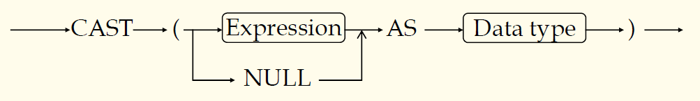
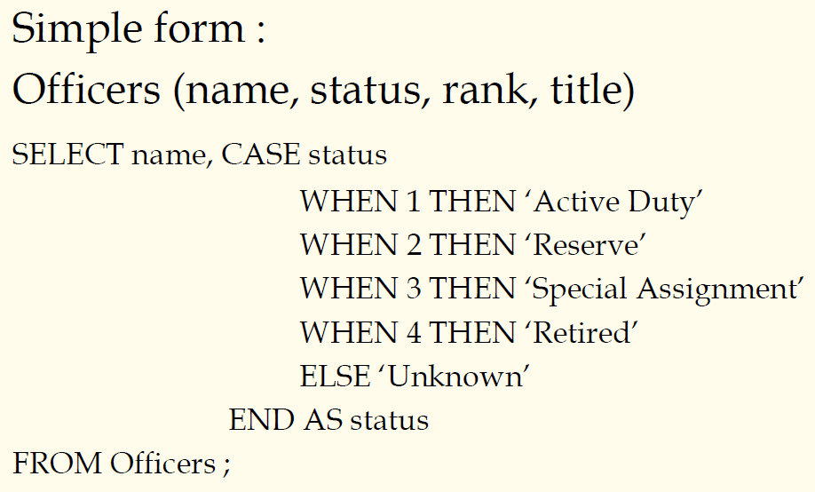
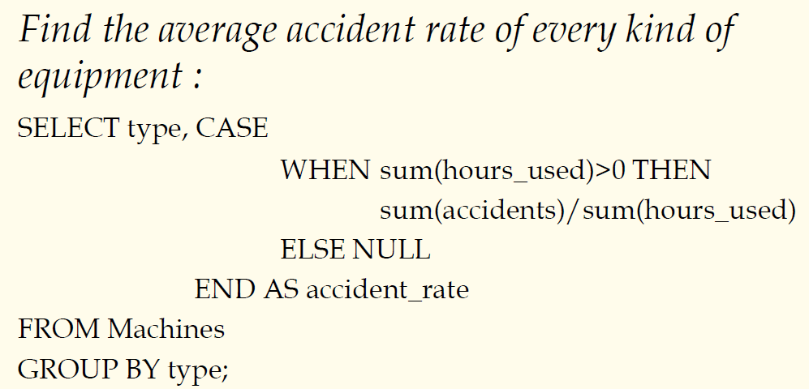

## 数据库原理与应用 第二十二讲 SQL分组与聚集函数

- 作者：**赵明心**
- 日期：**2019年8月5日**
  
---

#### **例子（续）**

数据库系统会对这个例子报错，数据库不是按照人的思路来看，而是用最简单的语法检查，如果group-qualification中的属性在group-list中不出现，则数据库就会报错。因为一个通用的数据库产品不会针对特定的业务进行设计，因此不会帮助进行语义上的分析。最简单的方式就是在GROUP BY子句中添加一个B.color属性，这样在group by子句中的属性在having子句中也出现了，而且这个时候对分组结果也不会产生影响。对于我们特定的例子来说，分组按照船编号和船颜色是一样的。

或者直接在HAVING子句使用In，使得HAVING在红色船中选择船的编号，这样得到的结果就是正确的。

## 数据库原理与应用 第二十三讲 空值问题与SQL扩展

所谓空值就是元组中的某一个或者某几个值的属性不知道，或者某个属性根本不可用。例如职工基本信息表，包含年龄、性别、家庭住址等等，其中一项是配偶，对于单身的来说，配偶一项应该是不可用的，必须是空值的。要注意的是，空值是不知道、没有，而是不知道。

引入空值之后会带来一些问题，引入空值之后，需要在WHERE和HAVING子句中增加一些判断。

### **扩展内容**

此部分内容按照DB2的定义举的例子，其他的SQL数据库的具体表达可能会有差异，这些是新的SQL特性，具体的有：
- CAST表达式
- CASE表达式
- 子查询
- 外连接
- 递归查询（SQL新标准）

逻辑数据库可以计算传递闭包，而SQL旧标准不支持，但是在新标准中可以借助递归查询实现传递闭包。

#### **CAST表达式**

有时为了满足并兼容条件，可以借助CAST语句给空值赋予数据类型。CAST语句有点类似于C语言中的强制类型转换。
- 将表达式改成目标数据类型
- 确定的目标类型
- 使用方法
  - 匹配函数参数：substr(string1, CAST(x AS Integer), CAST(y AS Integer))
  - 改变计算精度：CAST(elevation AS Decimal(5,0))
  - 给空值赋予数据类型，使之符合运算要求（常用）

#### **CAST例子**

学生所在学校是最大长度20的变长字符串，士兵的服役类型也是最大长度20的变长字符串。现在需要定义一张视图，将两张表合并成一张表。

| | | |
|:--|:--|:--|
| 姓名| 学校|服役类型|
|--|--|--|

这里为了满足并兼容条件，专门给students表补了一列，并且赋予空值一个数据类型是变长字符串，同时给soldiers表也补了一列。

#### **CASE表达式**

CASE表达式最简单的用法，军官表：
- Officers(name, status, rank, title)

设计数据库的时候，我们在设计数据库的时候经常对表里面的属性进行编码，例如在本例中，我们对Status服役状态属性进行了编码，使用1~4分别表示不同的状态。这种方法本身是没有问题的，但是将来在进行查询的时候，人在看的时候很不友好，不能直接从1到4看出状态是什么。最简单的转化是使用CASE表达式。

分母是对总事故数求和，分子是借助CASE语句进行过滤之后的故障数量。

