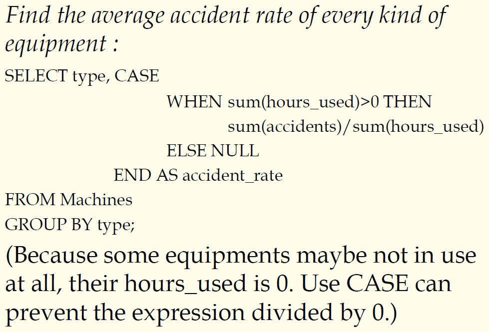
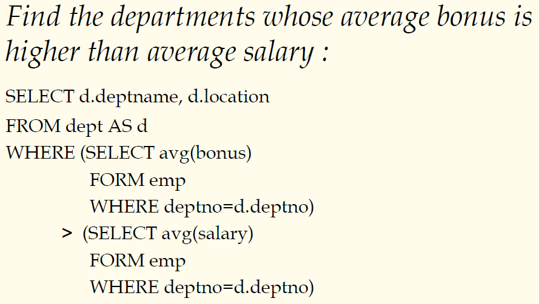
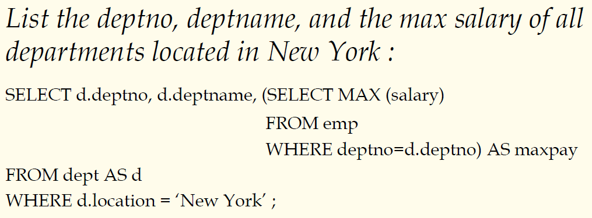
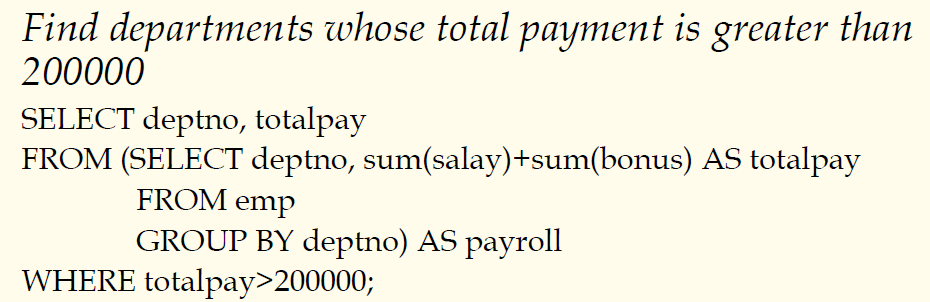

## 数据库原理与应用 第二十四讲 标量子查询

- 作者：**赵明心**
- 日期：**2019年8月6日**

---

#### **CASE表达式（续）**

- 通用形式（使用搜索条件）
  - Machines(serialno, type, year, hours_used, accidents)
- 找到“链锯”的总故障事件中的故障率
  > SELECT sum(CASE
  >  WHEN type="chain saw" THEN accidents 
  >  ELSE 0e0
  >  END )/sum(accidents)
  >  FROM Machines;

如果查找每一种设备的平均故障数？此时可以借助GROUP BY子句实现，按照设备类型进行分组，每种设备计算一个故障率。

### **3.1.8 子查询 sub-query**

子查询可以分为三大类:
- 标量子查询scalar，标量子查询结果就是一个数值，例如查询最大年龄
- 表表达式，table expression，其查询结果仍然是一张表
- Common table expression，公共表表达式，一个子查询可能不止出现一次，可以合并起来得到一个公共表表达式提高效率

#### **标量子查询**

- 查询结果是一个single value，凡是可以出现一个值的地方，都可以出现一个标量子查询，例子：

第一个bonus子查询的结果其实就是一个标量查询，同样地，第二个子查询的结果也是一个标量。

- 第二个例子

#### **表表达式**

- 子查询的结果是一张表，可以放在表能够出现的地方，此处的year是一个函数，是对日期date取年份，这个子查询相当于先做了一个子查询，得到了一张临时表，在这张临时表上面，需要对入职年份进行分组，在select语句中做的是求平均收入。子查询先得到临时表：

| | | |
|---|---|---|
|name|pay|startyear|    
| | | |

- 又一个例子

