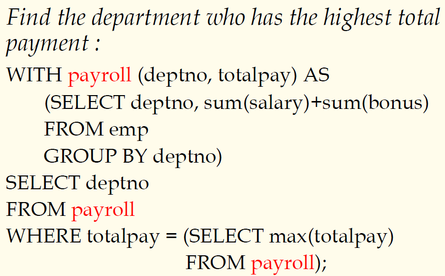
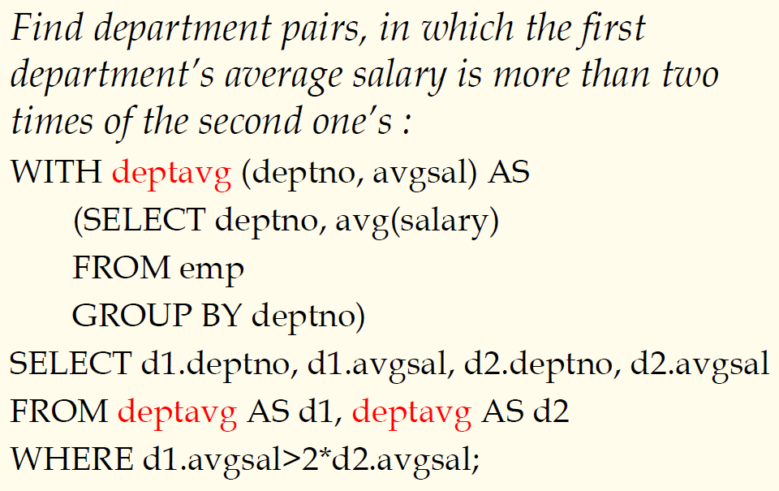
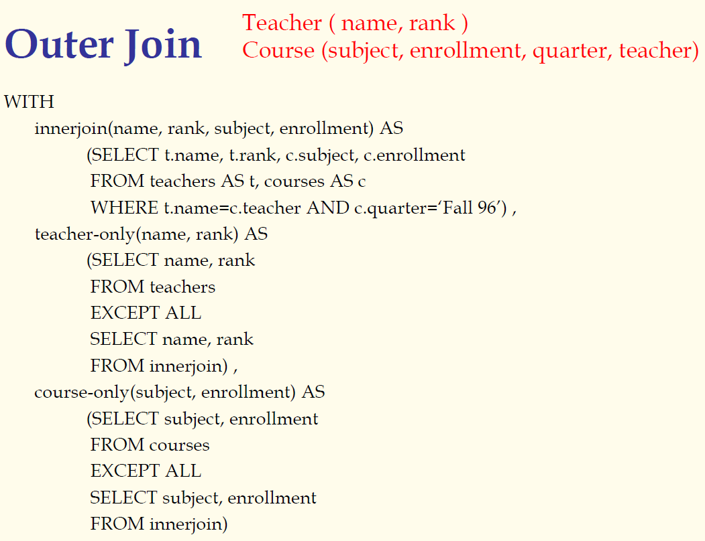

## 数据库原理与应用 第二十五讲 表表达式与公共表表达式

- 作者：**赵明心**
- 日期：**2019年8月6日**

---

#### **公共表表达式**

由于每个临时表（表表达式）可能需要重复使用多次，如果多次重复定义临时表，可能会影响查询效率，所以这里其实可以定义一个公共表表达式，借助with子句可以定义公共表表达式，使得后续可以继续使用。with子句（公共表表达式）可以作为一个临时视图。例子：

查找哪个部门的总收入最高，实际上需要使用雇员表，先制作临时表

|||
|---|---|
|deptno|totalpay|
|||

下面就是求哪个deptno对应着totalpay的最大值在哪。这张表实际上需要计算两次，第一次是查找totalpay的最大值，第二次是计算deptno中totalpay等于最大值的那个deptno。这时候使用了with，as后的查询块就是公共表表达式的定义，也即之前的那个嵌套子查询。有了临时表之后，真正的查询语句就开始了：

在内层子查询中先计算了最大值，在外层查询当中计算了deptno的值，对应于最大的totalpay。

> ***公共表表达式主要用在需要多层关注一个查询的地方***

- 一个更复杂的公共表表达式的例子：

为了查找部门对，需要对“部门号-平均工资”临时表进行自连接，自连接之后组合出所有的可能性，然后对平均工资满足第一个部门是第二个部门二倍的进行筛选。

### **3.1.9 外连接**

- 如何用SQL的语法表达外连接呢？这个时候就需要使用公共表表达式
- 例子如下：

需要对没人上的课、没法开的课、没有开课的老师进行罗列，对此类的空属性进行补空值。

这样其实就是在求外连接，先使用with表达式求临时表，拼接临时表。注意此处使用的是except all而不是except。如果不加all，在做集合差的时候会消除重复元组，为了消除重复元组就需要对元组进行排序，为了提高执行效率，如果结果中出现重复元组并不会影响查询的结果，就可以使用except all来保留重复元组。

以上例子借助一个with子句就选择得到了表格的三部分。
