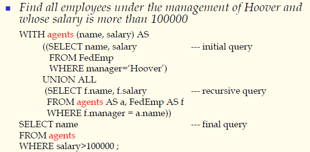
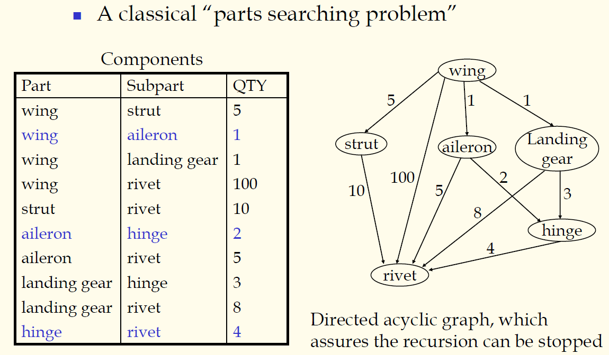
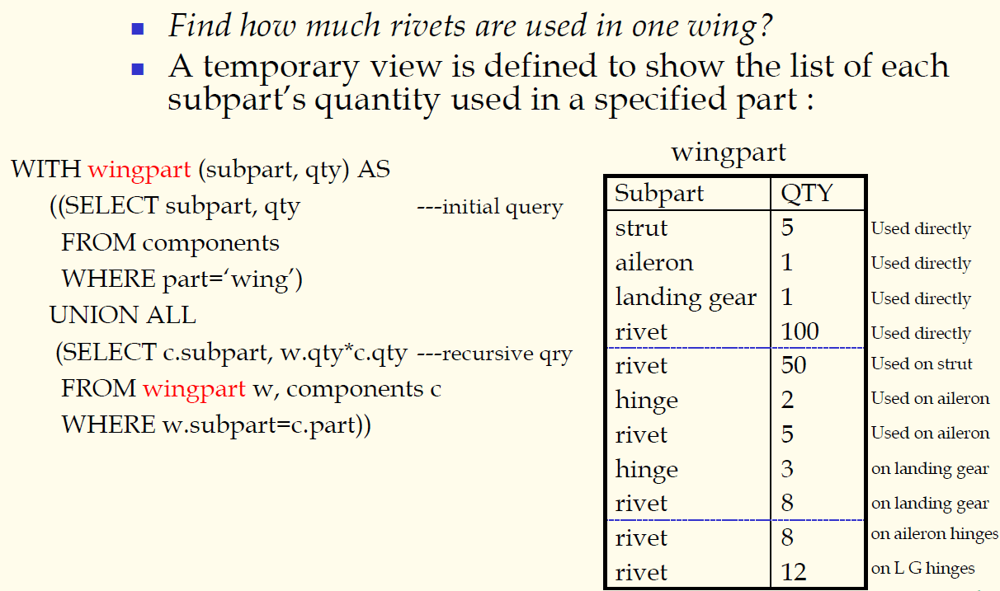
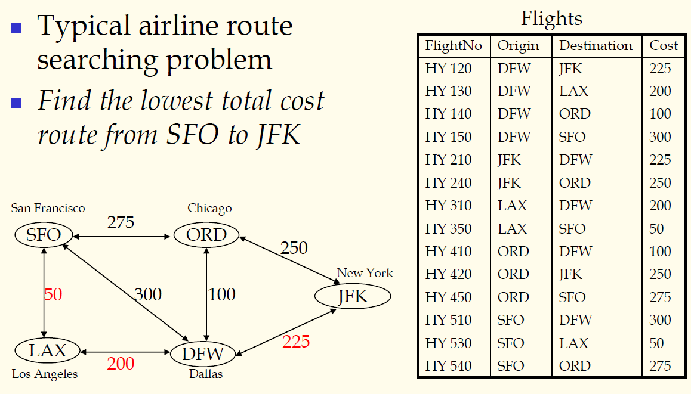
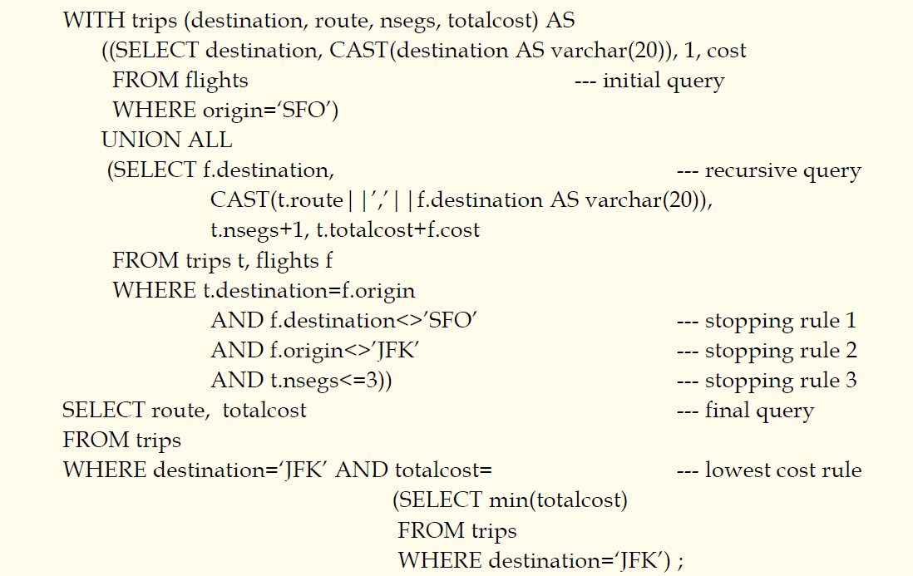

## 数据库原理与应用 第二十六讲 递归子查询

- 作者：**赵明心**
- 日期：**2019年8月6日**

---

### **3.1.10 递归子查询**

如果在公共表表达式的定义当中使用到了自己的话，就是一个递归查询。

做这个查询需要一个临时表，其中包含两列，第一列为雇员的名字，第二列为雇员的薪水。递归是可以安全结束的，先递归第一层Hoover的直接下属，然后递归下属的下属，以此类推直至找到所有的Hoover下属。

以上是最基本的递归查询，首先定义initial query，之后在initial query的基础上再进行recursive query，然后得到后续的。

#### **例子，零件装配关系表**

零件装配关系是一个有向无环图。这时候提问，飞机机翼上一共需要多少铆钉？为了回答这个问题，还是需要制作临时表，在临时表的基础上回答问题。

这个临时表例如叫wingpart，在此表计算每种子零件的零件名称和数量。与刚才类似，先计算飞机机翼上的直接子零件，再看子零件的子零件。但是在此处具体的零件个数是需要计算的。

注意这个例子计算航班的时候是无法直接查询到合适的航班的，因为中间缺少合适的中转航班。在递归查询的情况下，可以使用递归来实现传递闭包运算来实现一定的推理能力。一般情况下，经过中转航班可以找到合适的航班到达目的地。为了实现这个查询需要制作临时表，从旧金山出发，中转一次、两次...一直到达目的地。

称这张临时表为trips，第一项叫destination，第一项是从旧金山出发可以到达的可能目的地，第二项为route，表明从旧金山出发要达到目的地需要经过的路径。第三项为nsegs，表示中转几次，最后一项是所需要付的总钱数。

注意此次查询的时候，递归的结束条件是不一样的，增加了三个递归结束条件。

### **总结**

SQL部分的查询基本结束了，都是基于SELECT语句的查询，单表的查询比较简单，涉及到多个表的时候最基本的就是基于**连接**，例如连接水手和预定表，同样地可以借助**嵌套查询**、**关联嵌套查询**、**集合运算**等等。在基本查询的基础上还可以进行分组和聚集函数运算，在基本运算基础上借助分组和聚集进行统计运算，做计数、求平均、最大最小等，再借助GROUP BY进行筛选。最后在扩展SQL用法当中使用的最多的是，CASE、CAST、表表达式以及标量子查询还有借助公共表表达式的递归子查询（树形递归、图内的递归等等经典例子）。

在基于逻辑的数据模型上开发的演绎数据库可以具备一定的推理能力实现传递闭包，这个在下册中有介绍，而我们的递归子查询只能实现一些比较简单的推理计算。查询的航班信息实际上在原始的表当中实际是不存在的。