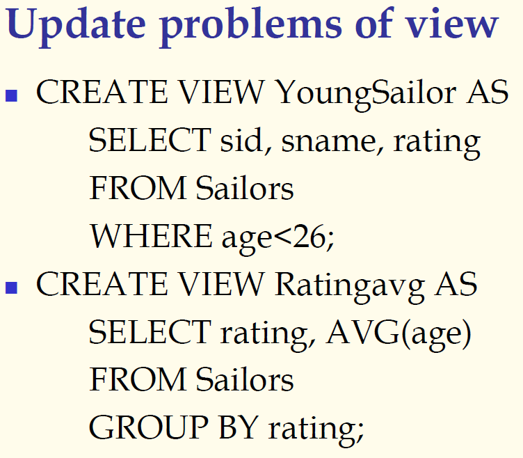

## 数据库原理与应用 第二十八讲 数据操纵语言

- 作者：**赵明心**
- 日期：**2019年8月12日**

---

数据操作语言这里只介绍三条，分别是INSERT、DELETE、UPDATE，也即插删改。

### **3.1.11 INSERT**

向表当中插入一个元组。

### **3.1.12 DELETE**

在表格当中删除一个元组，DELETE可以删除某种满足条件的多条元组。

- DELETE FROM Person WHERE LastName="John"

由于之前已经详细介绍了WHERE的用法，这里和SELECT的WHERE用法是一样的，所以不做详细介绍。在DBMS内部实现的时候，DELETE实现实际非常简单，只要实现了SELECT，就可以实现DELETE。

### **3.1.13 UPDATE**

先找到满足条件的元组，之后按照属性值进行更新。其中关键的是SET，SET指定了修改哪些属性，如何修改。

- UPDATE Person SET Address="Zhongshan 23",City="Nanjing" WHERE LastName="Wilson"

UPDATE语句的使用也非常简单，只需要按照条件查找然后使用SET语句进行更新就可以了。

## 三（4） SQL中的视图

在讲解数据库的三级模式两级映射的时候讲解过视图。

- 普通视图
  - 由基表衍生出的虚表
  - 逻辑表独立性
  - 数据安全性
  - 视图的更新问题
- 临时视图和递归查询
  - WITH
  - RECURSIVE

普通视图是CREATE VIEW语句创建的虚表，与CREATE TABLE创建的基表不一样，基表以某种形式存储在磁盘上，视图是基表基础上利用查询定义出的表，并不直接存储在磁盘上，只是存储了视图的定义。

表很大的话可能存储在磁盘上作为临时文件，如果比较小可能直接在磁盘上，视图的定义例如YoungSailors是存储在数据库中的。之后做实验的时候可以看到，SQL Server存在一些系统表，其中一些表描述视图定义，系统表记录了用户的视图定义。

