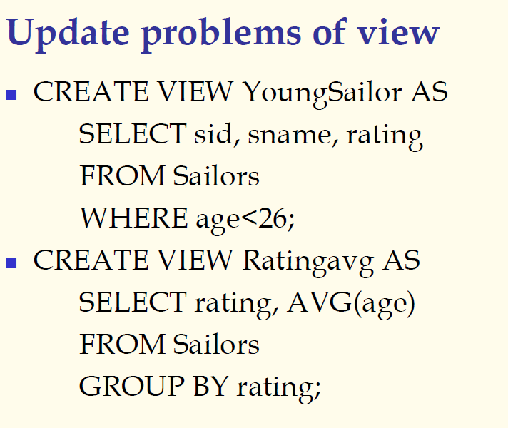

## 数据库原理与应用 第二十九讲

- 作者：**赵明心**
- 日期：**2019年8月13日**

---

## 三（4） SQL视图（续）

对于一些敏感数据，可以借助视图的方式实现数据安全控制，使用户无法看到一些保密信息。但是对于逻辑视图而言，存在视图更新问题，因为视图是临时计算出来的，早期DBMS只允许进行读操作而无法更新，但后来发现，实际上视图中的数据只要能够映射回基表，在某些情况下就可以允许更新。只要保证视图的属性值可以唯一的映射回去就能保证修改数据库的时候不会产生问题。

对视图中的属性进行修改的时候，修改的就是对应的基表中的属性。所以要求就是视图中的信息和基表中的信息可以建立唯一的映射关系，在什么情况下可以满足这样的条件呢？

例子：

如果不能有这种对应关系就不能进行从视图到基表的更新。

在视图到基表的更新的问题上，不同的数据库产品有不同的规定，一般来讲，只要数据库产品只要支持更新，那么只进行选择和投影的视图是可以进行更新的。

### 临时视图

临时视图实际上跟之前的公共表表达式是很类似的，在公共表表达式里也会定义一个临时的表，但是它和临时视图还有一些不同之处，就是临时表是在执行SQL语句的时候会建立临时表，但并不会永久保存这个定义，所以称为临时视图。使用CREATE VIEW定义的临时视图，虽然也不存储数据，但是还是会有配置存储在数据库当中。

## 三（5） 嵌入式SQL

嵌入式SQL是做什么的呢？讲到这里讲的多是单个SQL语句，如果是从事信息系统开发，那么就需要从应用程序访问数据库，然后实现一些业务逻辑。嵌入式SQL就是需要在程序设计语言中解决访问数据库的问题。

SQL语言是操作语言，本身不具备编程的能力，为了基于数据库进行开发，那么就需要某种程序设计语言来配合。

- 为了使程序能够访问数据库，并能获取和处理查询结果，需要将SQL与编程语言结合（例如C/C++）
- 有一些问题需要解决
  - 如何在程序设计语言中接收SQL声明
  - 怎么在程序设计语言和DBMS之间交换数据和信息
  - DBMS的查询结果已经得到的情况下，怎么将它传递给编程语言的变量
  - DBMS的数据类型和编程语言的数据类型可能并不完全一致

其中变量的传递是最关键的，程序设计语言都是以变量为基础的。