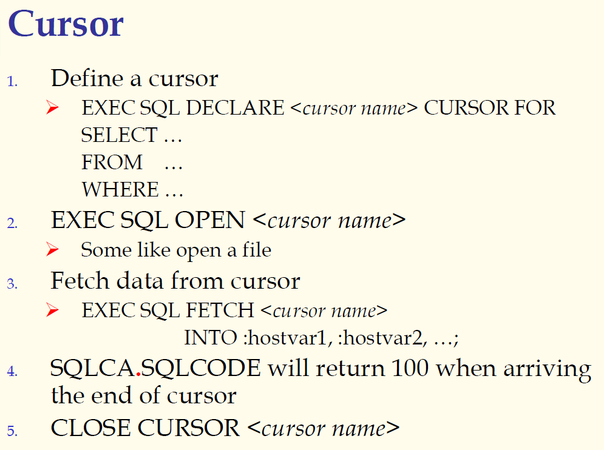

## 数据库系统与应用 第三十讲 嵌入式SQL

- 作者：**赵明心**
- 日期：**2019年8月13日**

---

## 三（5） 嵌入式SQL（续）

一般解决方案：

- 嵌入式SQL：这是最早的解决方案，嵌入到程序设计语言的代码，再进行预编译，使得嵌入的SQL的语言变成对库函数的调用
- 编程API，现在用的比较多的实现方案，就是基于API的解决方案，用户直接调用编程的库函数。例如ODBC等，ODBC只是一个标准，只定义了函数标准，具体的实现是每个厂家来实现的，例如Oracle、sql server等都有不同的实现方法，只要定义了接口就便于在不同的平台上移植。不管是厂家的API还是标准的ODBC，都属于第二类解决方案。
- 类库，在面向对象语言出现之后，程序设计语言封装了一些数据库访问的类，使得比以前更加方便访问数据库。在一个程序设计语言中访问类库的时候，都是需要解决之前的几个问题。

虽然现在嵌入式SQL并不怎么常用，但是嵌入式SQL是最基本的，所以还会在课程中讲述，讲解数据库系统最基本的原理。

### **3.5.1 嵌入式SQL（以C语言为例）**

最早期的嵌入式SQL就是在C语言中实现的。嵌入式SQL语言引入了一些符号
- 以EXEC SQL开始，以分号“;”结束
- 通过宿主变量host variable的形式在C和SQL之间传递数据和消息，宿主变量定义在EXEC SQL中。
- 在嵌入式SQL中，可以使用冒号来引用宿主变量的值，在C代码中宿主变量可以当普通变量
- 宿主变量不能定义成数组或结构
- 一种特殊的宿主变量，SQLCA（SQL Communication Area，SQL通信区），EXEC SQL INCLUDE SQLCA，可以借助SQLCA实现C程序和数据库交换信息
- 使用SQLCA.SQLCODE可以判断返回结果的状态
- 使用indicator（说明符，短整型）来处理宿主语言中的空值，C语言中没有空值的概念

#### **定义宿主变量**

前面带冒号的都是C本身的宿主变量，而不带冒号的都是SQL自身的变量。

一个普通的SQL查询其返回结果是一个集合，如果查询的时候返回了多个元组（一个集合），这时候该怎么办？对于一般的SQL查询，其返回值就不能这样处理了。这时候就需要使用游标（Cursor机制），借助游标来处理一般查询结果的返回结果集合。

打开游标就是让DBMS执行这个查询语句，一旦open了游标，就可以将游标当作一个文件来理解。执行结束之后有返回结果，返回结果集合可以看作文件。利用游标的名字就可以访问一个文件。我们在访问文件的时候，都是借助指针来访问，而游标也是类似的。我们将返回结果作为文件，文件名就是cursor的名字，一开始指向返回结果的第一条元组，之后可以使用fetch操作取其中的一个值，每处理一个元素就向下走，继续处理下面的元素。

怎么取结果中的每条元组，并将值传递给C的宿主变量呢？就是借助fetch。