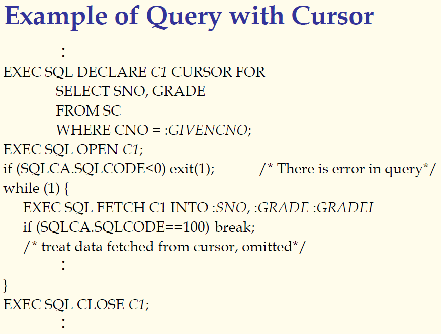
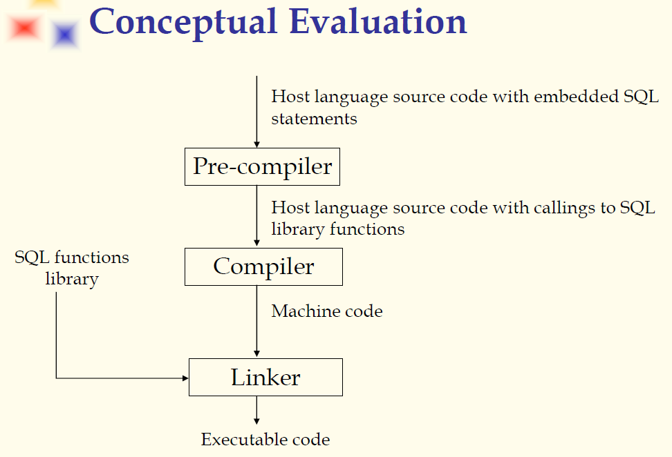
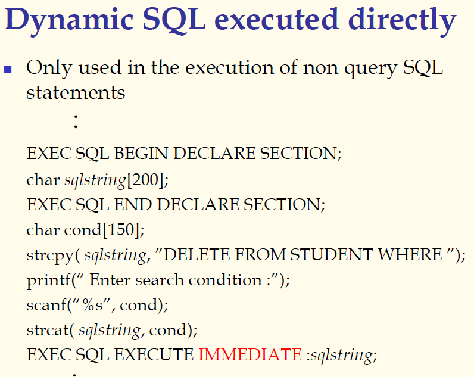
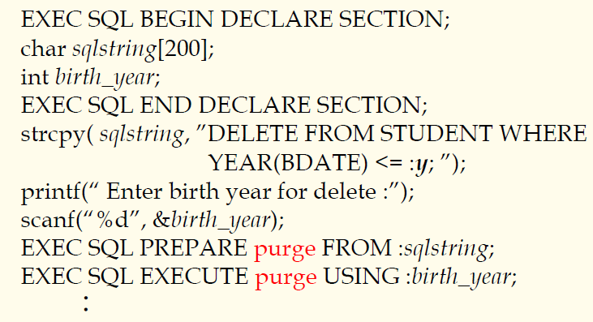

## 数据库原理与应用 第三十一讲 游标处理查询结果

- 作者：**赵明心**
- 日期：**2019年8月14日**

---

### **3.5.2 游标处理查询结果**

每fetch一次，结果都会向下寻找一次。当全部都处理完的时候，就可以close游标，游标所对应的资源也就被释放掉了。将来不管使用什么办法，使用API或者类库的时候，使用程序设计语言处理查询结果的时，基本都是借助循环来每次处理一个结果，循环完的时候就把里面的返回结果全部处理完毕。

程序代码的框架基本都是这样的。

以游标处理查询结果的例子：

实现嵌入式SQL的关键是如何实现DBMS和程序设计语言之间进行数据和信息交换，以及如何对查询结果集合进行遍历。在C语言中借助宿主变量和游标来解决这两个问题。

### **3.5.3 动态SQL**

有时候在做程序开发的时候，程序运行之前事先无法确定那条语句到底是什么样子，有时候需要临时拼装该执行什么SQL语句，在这种情况下是动态SQL需要解决的问题。

- 动态SQL在嵌入式SQL中已经得到了比较完善的支持，使用ODBC\JDBC等也支持这种动态方法。在此处还是借助嵌入式SQL讲解。
  - 可直接运行的动态SQL，一般是非查询的插删改语句
  - 带动态参数的动态SQL
  - 动态SQL查询语句

#### **可直接执行的动态SQL**

第一种，可以直接执行的动态SQL，一般是插删改语句（非查询的）。这里到底该删除什么样的学生，需要用户在运行的时候来决定，这个时候需要动态SQL。

在运行时动态拼一个SQL语句

IMMEDIATE就是让数据库立即动态执行该句SQL语句，这样实现了动态执行一条动态构建的删除语句，这条语句在程序运行之前是无法确定的，需要用户在运行时确定。

#### **带动态参数的动态SQL**

在书写SQL的时候可能存在某些参数选项无法确定，这个时候就可以借助占位符，在编写的时候使用占位符先预留位置，在实际使用的时候根据输入来替换占位符。占位符的实现和C语言的宏替换很相似，在预编译的时候替换源程序中的宏。

以下是动态参数的例子：

在BEGIN和END中间定义两个宿主变量，一个是sqlstring，一个birth\_year。BDATE是student表的属性，表明日期。当出生年份小于等于某一年的学生删除掉，但是具体要删除哪一年是不知道的，需要运行程序的用户来决定到底删除哪些。既然无法确定，这个时候就没有办法写死，只能使用占位符，例如“:y”，这就是一个占位符，先占住位置，以后实际输入的时候才会有东西在那。