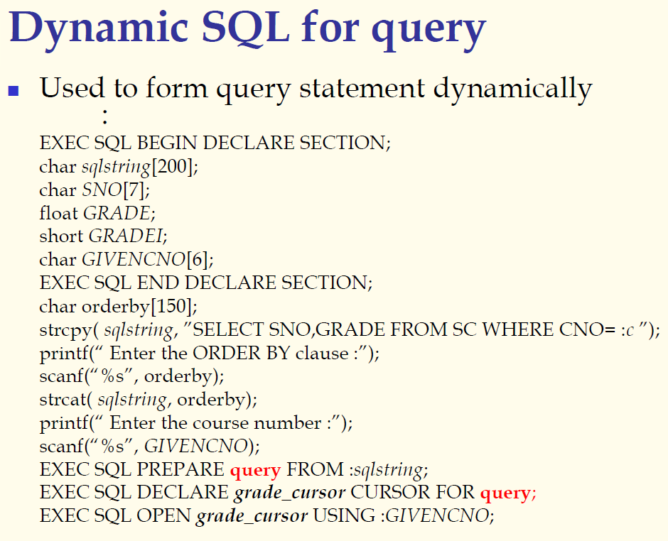
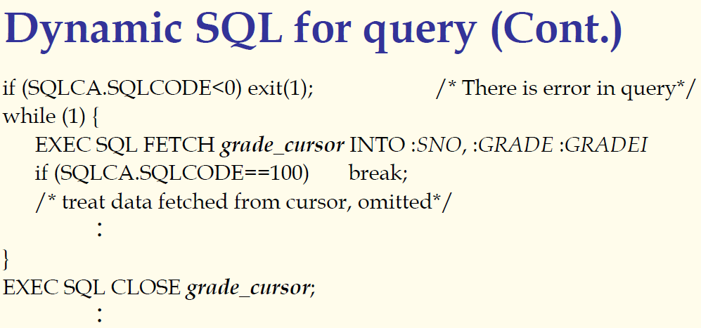
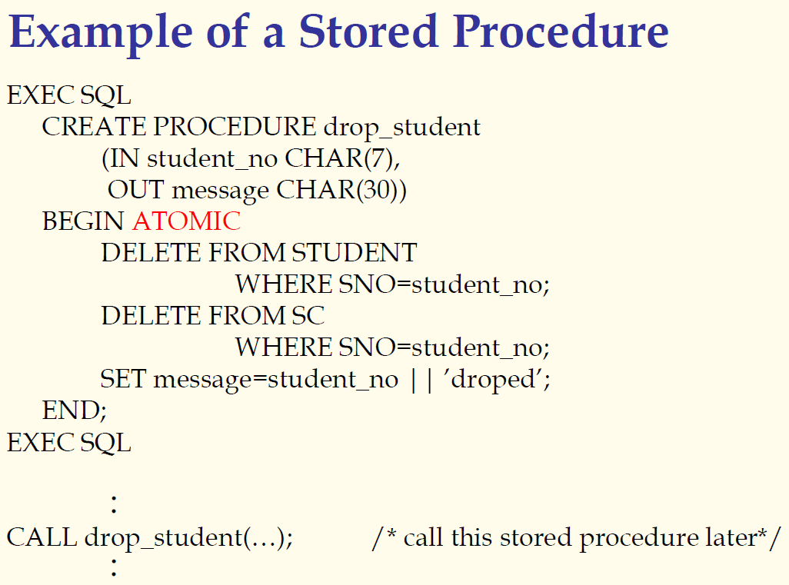

## 数据库原理与应用 第三十二讲 动态SQL与存储过程

- 作者：**赵明心**
- 日期：**2019年8月14日**

---

### **3.5.3 动态SQL（续）**

在实际执行的时候，EXEC SQL的时候使用purge语句引用birth\_year替换占位符位置，输入值是多少就使用多少来替换那个占位符。通过这个例子可以看到带动态参数的SQL是如何执行的。

在这里都不牵涉查询结果的处理。

#### **针对查询的动态SQL**

这时最复杂的情况，因为查询的返回结果是一个集合，需要定义游标，在动态SQL中，如何定义游标呢？因为查询是不知道的，所以游标也不知道。

### **3.5.4 存储过程**

存储过程是把开发团队中最常用的一组操作定义成一个过程，然后借助编译存储在数据库当中，可以改进使用效率，不必每次都写SQL查询语句。有时候一组特定的SQL语句，具有某些逻辑关系，这时候可以借助编译优化来提高使用效率。有时候一些查询在很多模块中都需要使用，这个时候使用存储过程就可以实现多次复用而不需要每个使用的程序员都要重复实现一个SQL逻辑，同时当应用需求发生变化的时候，如果多处使用了同样的SQL，那么需要多处修改，而定义了存储过程就只需要修改一个地方实现多处修改，使得系统维护变得方便。

- 使用户使用更加方便，用户不需要重复编码，提高复用性。
- 提升性能，存储过程是被编译过的，不需要再次进行解析和查询优化。
- 扩展DBMS的功能（可以写脚本），可以具备一定的编程能力，使若干语句按照逻辑顺序组装起来

以下是一个例子，使用了嵌入式SQL的方式实现存储过程：

使用存储过程，可以把需要连续做的事情放在一起，每次做的时候就不需要手工实现两次DELETE语句，而是直接使用存储过程就可以。BEGIN和END之间是存储过程的内容，ATOMIC声明说明了操作的原子性，要么全部成功，要么一条也不做。例如维持学生表和学生选课表的一致性，除了删除学生表中的学生之外还要删除选课表中的学生。

在第六次作业中的级联删除中可以使用存储过程来实现。