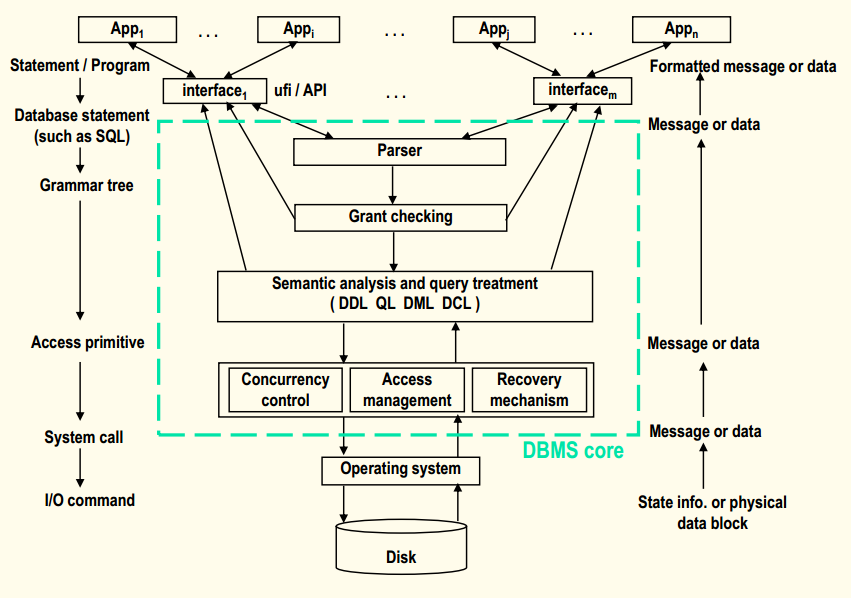
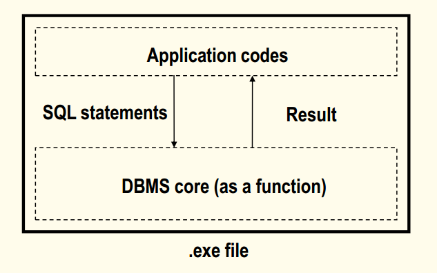

## 数据库原理与应用 第三十三讲 数据库管理系统结构

- 作者：**赵明心**
- 日期：**2019年8月15日**

---

## 四、数据库管理系统结构

了解DBMS内部的实现技术，有助于我们摸清自己所使用的DBMS产品的特点，使得我们开发的应用运行效率更高、更稳定。本章分成了几个部分：

- DBMS的架构
  - DBMS的内核组件
  - DBMS的运行进程结构
- 数据库访问管理
- 查询优化
- 事务管理
  - 恢复
  - 并发控制

访问管理是物理层的实现方式，直接跟操作系统打交道，把数据模型的概念转换成存储在磁盘中的文件，这个模块也就是存储管理模块。重点是介绍查询优化，就是一个SQL查询语句在DBMS内部的优化，怎么尽可能优化效率在海量数据中进行查询。最后是介绍事务管理，介绍企业级多任务多用户访问数据库的时候，保证多用户同时访问数据库的时候可以保护数据一致性，同时还有恢复机制，当出现软硬件故障和系统崩溃的时候可能会对数据库的一致性产生破坏，这就需要有恢复机制。

本章主要介绍以上四个方面的内容，理解这四个部分就可以对RDBMS有一个大致的认识。在研究生课程中，还有DBMS实现技术课程，会更加全面。

### **4.1 DBMS的核心模块组成**

有几大块，第一个是parser，主要是对用户的语句进行语法分析，其次是GRANT Checking模块，主要是检查用户是否被授权执行这条语句。之后是语义分析和查询处理模块，这个是一个DBMS核心中的核心，各种SQL语句的功能都是在这个模块中实现。再往下是物理层，实现将表的操作转化成对文件的操作。同时并列的还有并发控制和恢复机制。再往下就是操作系统。

往DBMS上面走就是一些用户接口，其中UFI是即席访问接口，就是用户借助命令行或者GUI等直接进行执行。还有一大类是API，就是像ODBC、JDBC等用户接口，这是数据库给用户提供的应用程序接口，UFI是即席访问接口，是交互式访问接口。无论什么接口都是提供给用户访问方法。在接口上运行的就是各种各样的应用程序。嵌入式SQL、ODBC等等都是在使用某种接口所提供的访问方法。虚线框所框的DBMS的核心只接收一种数据，就是SQL语句，由上层接口来统一将用户输入转化成SQL来提交给核心，再由核心的Parser进行分析，语法分析的结果生成一棵语法树，这个时候机器就可以知道用户的这条语句有什么作用，下面就可以进行权限检查。系统这个时候可以分析用户是否有权对某张表有插删改、查询等操作。

如果权限检查没有通过，用户会收到一条错误。同样的，在parser层，如果有语法错误，也会报错。实现查询和插删改操作的时候就需要物理层的API函数。在物理层，例如创建一张表，有可能就是操作系统创建一个文件，之后借助一些底层IO接口实现对磁盘上文件的读写。操作系统会向上返回一些信息或者数据，由于操作系统的数据是没有结构的，只是字符流，message信息在操作系统层返回的就是读写成功或失败的消息。而物理层向上层返回的信息就是有关系型概念的，例如对插删改操作是成功还是失败，再往上返回到接口层，在接口层进行处理，得到结构化和形式化的返回信息，例如查询信息返回结果是一个画好的表格。

DBMS的上下层关系，每层的接口和任务，以及整个流程就是这样的。但是这里面还没有设计并发控制和恢复，从DBMS的执行逻辑上来说，并发控制与恢复不是必须的，并发控制和恢复是企业级应用中必须的，但对于单纯执行来看并不是必须的。

### **4.2 DBMS的进程结构**

- 单进程结构
- 多进程结构
- 多线程结构
- 进程与线程间的通信协议

早期的简单的DBMS使用的就是单进程结构，例如Fox Pro支持一套特殊的语言，借助这套语言可以开发应用系统，开发完成之后具有发布和部署功能，通过编译和链接，生成一个EXE文件，可以拷贝到别的PC上直接运行，应用运行的时候也是只运行一个进程。早期的单机单用户系统都是这种单进程方式运行，应用代码与DBMS核心链接成为一个可执行文件。这种方式与Zip和RAR的自解压方式是一样的，自解压方式实际是将被解压文件和解压工具放到一起实现自解压。

