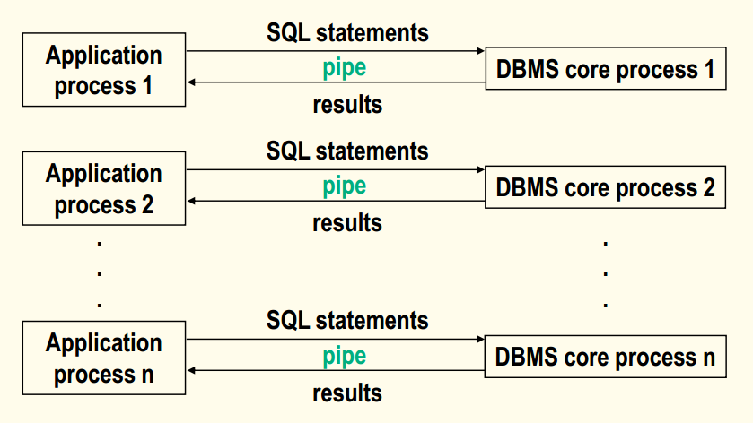
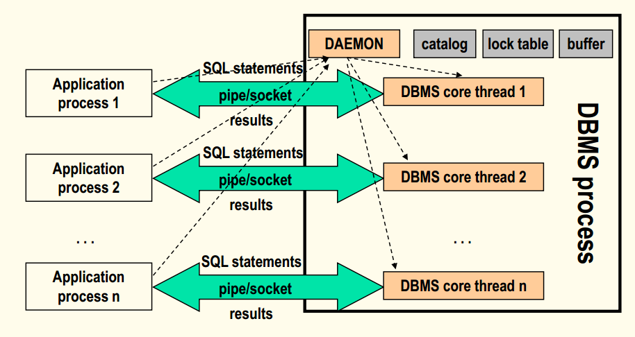

## 数据库原理与应用 第三十四讲 DBMS进程结构

- 作者：**赵明心**
- 日期：**2019年8月18日**

---

### **4.2 DBMS进程结构（续）**

当系统中有多个应用程序都需要访问数据库的时候，为了满足多任务多用户的需求，需要使用多进程的结构，之前虚线框中的DBMS核心部分作为一个单进程运行，而其他程序单独作为一个进程运行，当需要在应用程序中访问数据库的时候，调用connect命令实际上就是在向系统发出访问请求，这个时候操作系统会向应用创建一个DBMS核心进程，系统创建一个通信管道，PIPE是一个单向通信机制，为了实现双向通信，操作系统会创建两个管道。在网络环境下，PIPE就变成了SOCKET通信。

如果有很多应用程序需要访问数据库，就需要创建多个DBMS核心进程。

在多进程结构中，每个应用程序访问数据库的时候都会由系统创建一个DBMS核心进程，应用程序发送SQL语句给DBMS核心，DBMS将结果返回给应用程序。

我们在操作系统课程中知道，每个进程的创建都是需要消耗资源的，当在系统中运行的应用程序很多的时候，操作系统的资源会被快速消耗，系统性能会快速下降，这个时候出现了thread机制，也即线程。线程实际上是一种轻量级的进程，一个进程中的多个线程可以共享进程的资源，创建一个线程比创建一个进程需要的资源要少得多。在运行程序的角度来看，线程、进程是差不多的，不过线程可以共享资源。

有了线程机制之后，DBMS也提出了多线程结构，在多线程结构下，DBMS只有一个进程，当应用需要访问数据库的时候，DBMS会新创建一个线程，每有一个应用访问，就多一个核心线程。注意在DBMS启动的时候就会启动daemon线程。我们在connect数据库的时候一般都需要数据库的IP地址和端口号，这个守护线程作用就是监听端口，等待链接请求。DBMS中对数据库的访问都需要目录信息，这也是一种元数据，数据库中的表、视图、有没有索引这些信息都是在目录中的。包括查询语句刚进入数据库的时候，都需要查询目录信息，例如查询student表格，一开始就会查询目录中是不是有student表。

lock表就是封锁表，之后讲并发控制的时候，封锁表是并发控制的一种主要手段。buffer表是缓冲区，各种查询一般都需要用到缓冲资源。像目录、lock表、缓冲区都是在DBMS进程创建的时候申请好的。

当应用程序调用连接请求的时候，守护线程监听到之后，DBMS进程创建一个DBMS核心线程，之后创建一个管道，应用进程发送SQL语句给核心线程。而核心线程就是之前虚线框中的部分。daemon相当于一个无限循环，不断监听端口的请求，一旦创建好核心线程，守护线程会返回监听。一旦close，相对应的核心线程资源就被释放。

当系统中多个应用进程需要访问数据库的时候，多线程结构可以大大减少资源开销，现在主流的数据库系统采用的都是多线程结构。

### **4.3 数据库访问管理（物理层）**

关系型数据库，操作系统中的数据是没有结构的，整型数、浮点数需要应用来解释，当我们访问的时候需要确定到底在哪找到相应的字符流、怎么解释字符流。上面的parser模块实现的是对SQL的处理，对于关系模型来说SQL并不是必须的。所以关系型数据库的实现，实际是在物理层就已经实现了。在表上查找创建元组在物理层已经有了相应的实现，数据库访问的性能很多时候也取决于物理层做的好不好。

- 访问类型
- 文件组织
- 索引技术
- 访问原语

访问管理，主要实现把数据库的关系对象的访问转化成操作系统的文件的访问。关系型数据存储成文件的话可以存哪种呢？在数据结构中，我们学文件管理的时候知道，文件可以有堆文件、哈希文件、倒排文件等等，这个时候就需要把一张表转换成操作系统的具体文件。不同的文件结构其特点是不一样的，堆文件适合顺序扫描，但是堆文件不适合。不同文件结构的特点以及擅长的操作是不一样的，没有一种数据结构可以完美解决所有问题。所以我们首先需要分析在数据库里，通过物理层进行的访问类型有哪些，根据访问类型分析决定应该使用什么样的文件组织形式，来支撑这些访问需求。

除此之外还会介绍一些常见的访问原语。

访问类型：
- 查询访问一个文件中的所有或者大多数记录（>15%）
- 查询特殊记录
- 查询一些记录（<15%）
- 扫描查询
- 更新

这里定义当查询记录数据量15%以上的时候被划分成第一类访问，尽管这个比例并不算高。