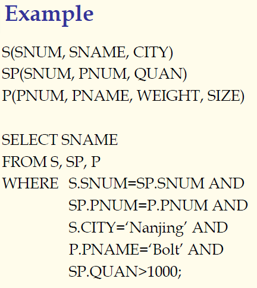
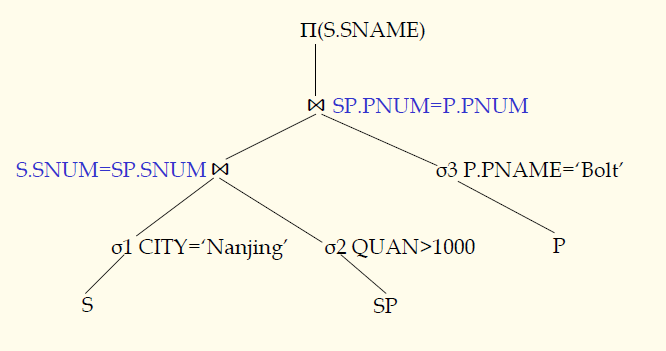
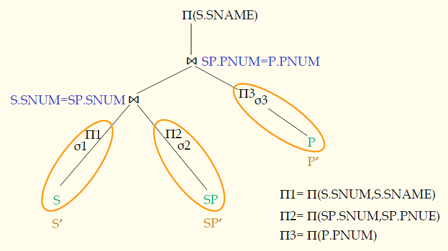

## 数据库原理与应用 第三十七讲 查询优化概述

- 作者：**赵明心**
- 日期：**2019年8月19日**

---

## 四（4） 查询优化

真正的查询如果做笛卡尔乘积，5万元组和10万元组的笛卡尔乘积能得到50亿的元组大小，如果文件用堆文件存储，那么存储效率也会非常低。所以关系数据模型刚提出的时候，因为效率问题，被很多人反对。为什么关系型数据库能成功？关系型数据库在查询优化技术上取得了突破，经过优化的关系数据模型查询效率可以和层次与网状数据模型的效率大致相当。

查询优化模块一般在RDBMS中是一个最复杂的模块。查询优化一般要做两步，有两件事情，先做“rewrite”重写，然后决定最优的实现方式。目标是以最低代价获得用户查询的结果。

查询优化就可以分成两部分:
- 代数优化：重写部分
- 操作优化：怎么利用文件操作更有效率地找到用户的查询

为了说明两步优化各自的作用，可以举个例子，
$$
x^2+2xy+y^2
$$
上式其实可以先通过变换得到$(x+y)^2$再计算，这样的效率更高。这就是代数优化部分，通过改写来对计算过程进行优化，将用户提交的初始查询变换得到效率更高的形式。操作优化是后续继续优化加法和乘法操作的实现。

查询优化是通过在查询树上的关系代数优化实现的。查询树的叶子节点就是表，中间的节点是各个关系代数操作。经过优化的查询树已经不是最初的查询树了，最初的查询树是对表进行笛卡尔乘积再借助WHERE条件进行投影。优化的查询树则没有那么多笛卡尔乘积。

查询树基本手段是将选择、投影操作尽量向下压，压了以后可以减少二维操作的结果数量，一元操作下压之后会过滤掉很多元组，实现了优化的效果。

