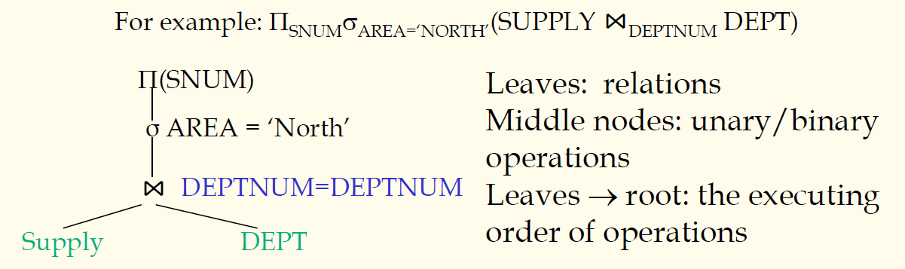
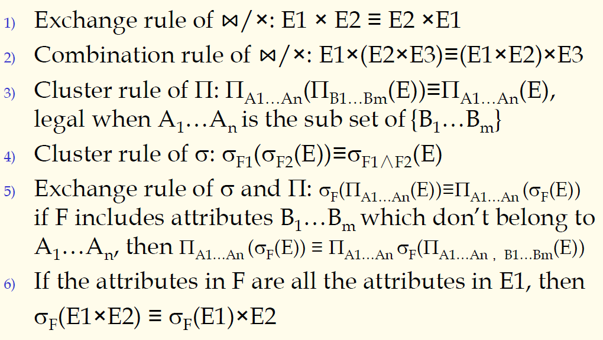
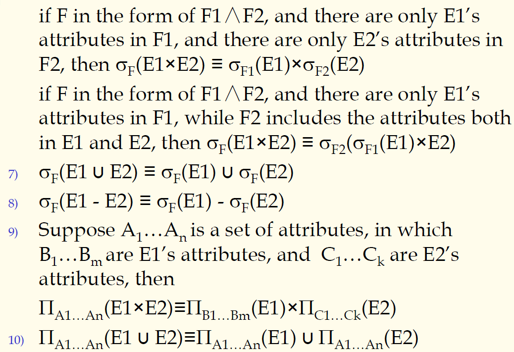

## 数据库原理与应用 第三十八讲 代数优化

- 作者：**赵明心**
- 日期：**2019年8月19日**

---

### **4.4.1 代数优化**

<!-- 等价变换规则： -->

<!-- 操作优化阶段重要做的就是连接操作，首先第一件事情是决定连接操作的次序。 -->

查询优化一般都是对查询代价进行可能性的预估，这个预估未必非常准确，不一定是best，最好策略。对于一个复杂操作来说，可能的操作会非常多，优化起来也会很复杂。下面以一个例子讲解代数优化和操作优化的内容。

一张表供应表和另一张表部门表，供应商表和部门表都有一个部门编号属性，先连接两张表再选择区域，最后投影到SNUM，这个操作就是为了查找隶属于北方的供应商的编号。用查询树来表达就是：

在查询树上面，每个叶子节点就是涉及到的一个查询，查询树的叶节点就是查询涉及到的关系。每个中间节点反映了一个一元或者二元操作。最后**从树叶到树根**的顺序反映的查询在DBMS内部的实现顺序。

之前还有DBMS的语法树，在语法树的基础上，借助等价变换规则对语法树进行代数优化，就变成了查询树。下面就是介绍查询树的等价变换规则：

凡是对笛卡尔乘积使用的规则对连接都适用。第一条规则说明了两个子树是可以进行交换的，左右子树顺序可以相互交换，连接与笛卡尔乘积还有结合律。第二条结合律相当于可以进行旋转。