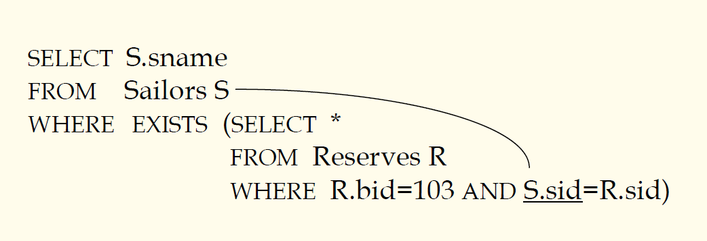
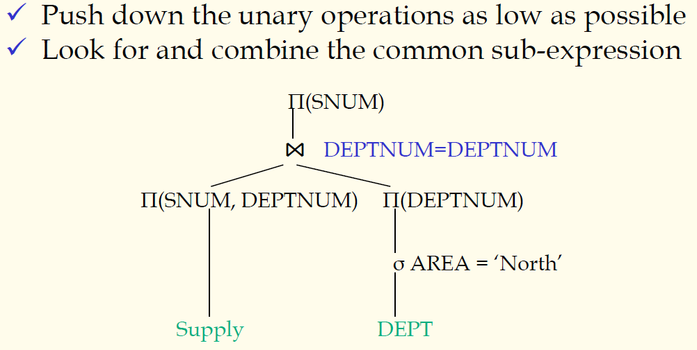

## 数据库原理与应用 第三十九讲 依赖于存取路径的规则优化

- 作者：**赵明心**
- 日期：**2019年8月19日**

---

### **4.4.1 代数优化（续）**

直接按照关联嵌套的格式来进行查询效率是很低的，因为需要不停地代入外层的参数，以至于嵌套的子查询会重复执行很多很多次，对于嵌套查询在DBMS内部一般需要解除嵌套，变成一个非嵌套的查询，两个表做连接，然后在连接的基础上进行投影操作。一般DBMS对连接操作都有很好的优化。解除嵌套也需要按照变换规则进行变换。

在这里列举的等价变换规则还是很简单的，在一个实际系统中，能支持的等价变换规则还有很多。在一个系统中如果没有一个规则能进行等价变换的话，虽然查询仍然可以做，但效率会很低很低。

#### 代数优化基本原则

代数优化的基本目标是使得出现在二元操作中的操作数尽可能地少。

- 尽可能下压二元运算符
- 对不止出现一次的子表达式识别出来，尽量只计算一次，寻找和合并公共子表达式（这个优化技巧在研究生课程会有详细介绍）

代数优化对二元操作尤其是连接操作进行优化。

### **4.4.2 操作优化**

操作优化是在代数优化改进过的查询树上面再进行优化。在操作优化阶段需要考虑几类操作，选择、投影、集合运算、连接

- Optimization of select operation
- Optimization of project operation
- Optimization of set operation
- Optimization of join operation
- Optimization of combined operations

选择、投影都是一元操作，比较简单实现，此处略去。集合运算相对来讲，其运算代价一般是两个参与运算的元组的和，此处也不详细讲。在关系型数据库中**影响效率最大的是连接运算**，在第六章讲解数据库设计的时候还会详细介绍，数据库设计的时候要求要达到三范式的原则。连接运算的复杂度是参与运算的两个集合元组个数的乘积，这个要重点讲解。最后的组合运算，是将多个操作合并实现，例如在实现投影的时候选择等等。

这里重点讲解连接操作，介绍几个实现连接操作的经典算法，在关系型数据库中实现连接最基本的是嵌套循环。一个关系$R$和一个关系$S$，按照公共属性的值相等进行连接，为了保证每个元组的属性确实都比较到了，保证不发生遗漏，如果没有任何存取路径可用，例如两个关系都被存储成堆文件，这个时候就需要使用嵌套循环来实现。

关系$R$作为外循环关系，关系$S$作为内循环关系，嵌套循环保证两个关系的元组属性两两比较，然后在循环的时候依次使用其中一个关系的元组去遍历比较另一个关系的所有元组。但是这样效率其实是很低的，现在存储使用的都是磁盘，磁盘读写的时候需要寻道，磁头移动是机械运动，每次做IO的时候都需要读取硬盘，从代价上来讲，CPU代价相对于磁头移动的时间代价可以忽略不计。为了提高查询的性能，手段就是减少查询的时候需要的IO次数。

在循环的时候，每次读取外循环关系一条元组，就需要遍历内循环元组，这个时候会重复进行多次读取，效率低下。但是我们知道硬盘是块设备，每次读取实际上读取的是一个物理块，那么我们可以每次多读取一些。我们将磁盘IO的单位变成物理块，在UNIX操作系统缺省是1024个字节，每次读取一起读取1024个字节，一条元组如果是100个字节，那么可以有10个元组。