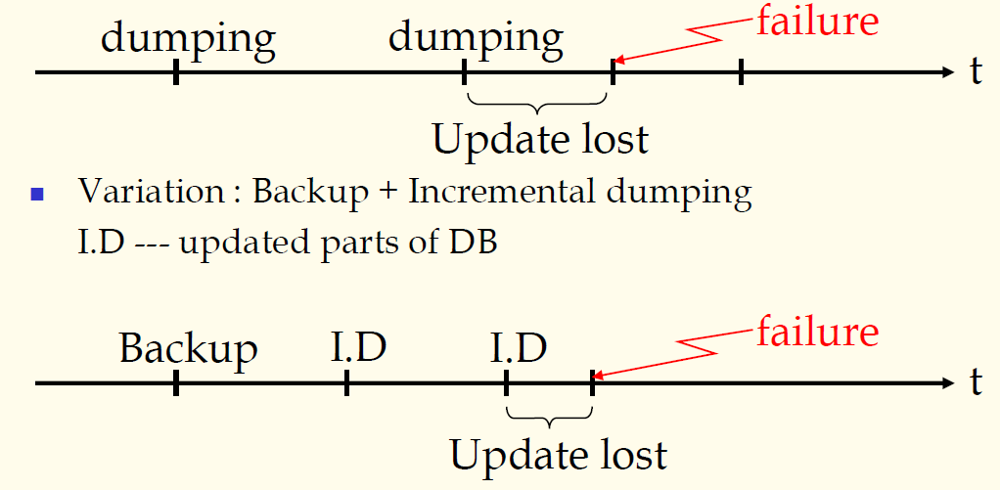
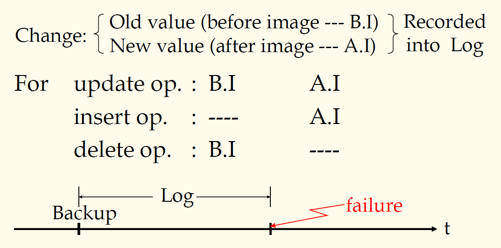

## 数据库原理与应用 第四十一讲 恢复机制概述

- 作者：**赵明心**
- 日期：**2019年8月20日**

---

## 四（5） 恢复机制

简单介绍一下什么是恢复机制，恢复是企业级数据库必须具备的功能。

作用有两条：
- 减小系统发生故障的可能（防，通过一些手段提高系统运行的可靠性）
- 从故障中恢复（能够恢复由于故障导致的数据库中的数据不一致）

一个系统在用户读写的时候突然发生停电，这个时候数据库系统需要有能力把数据恢复到一致状态。

- 冗余是必须的（注意这个不是结构上的冗余，结构冗余是数据库设计不合理导致的，这个冗余是备份造成的冗余）
- 能够检测到所有可能的故障（注意是检测到，而不是解决）

有些故障对于DBMS来说，不一定能够解决，但至少DBMS需要能发现故障状态。如果有某种故障状态在DBMS中是不知道的，在DBMS中还在持续运行的话就会出现BUG。

### **4.5.1 常用策略**

1. **周期性转储（Periodical dumping）**

这种方式可以将故障数据库恢复到最近的故障点备份文件上。假设每周备份一次，等到周三的时候崩溃，周一和周二的数据就会丢失，所以为了解决这个问题，就有了变种，增量备份和转储方式。备份的时候只备份变化的部分，整个数据库很大，但是每次变化的部分可能很小。

使用增量转储可以减少备份的代价，每个一个月进行一次完整备份，每天做一次增量备份。在数据库早期，90年代初的时候，开发一个应用系统，例如财务处发工资的应用，每张表存成一个DB文件，对于Dbase这种小应用，没有备份的功能，备份只能靠人工进行，比如借助备份软盘每天进行一次备份。

现在的企业级数据库是依赖于“备份+日志”的方式进行的。

2. **备份+日志（Backup+Log）**

日志记录用户对数据库进行的每一次改变，日志需要记录数据库项的旧值，和修改后的新值。需要记录对数据库进行的每一次修改。数据库系统中有可能改变数据库内容的操作有哪些呢？

- 更新操作：有新值也有旧值
- 插入操作：没有旧值只有新值
- 删除操作：只有旧值没有新值

遇到故障的时候借助日志的流水账，就可以重演用户操作，使得数据库恢复到崩溃之前的状态。

这种方式相对于转储方式来说不会有更新丢失的现象。虽然有时候会出现在崩溃的时候某个操作只进行了一部分，但也可以借助日志，来恢复half-done的值。有些事务可能已经做了，但其结果还没有完全写入数据库，这个时候也可以借助日志文件重做用户的操作，保证数据的一致性。借助这两种方式避免了转储的丢失更新问题。

在日志方式恢复的方式中，引入了事务（transaction）的概念，数据库是以事务的基本单位来运行的，就像在操作系统中，程序以进程为单位运行一样。事务是数据库操作的基本单位。

