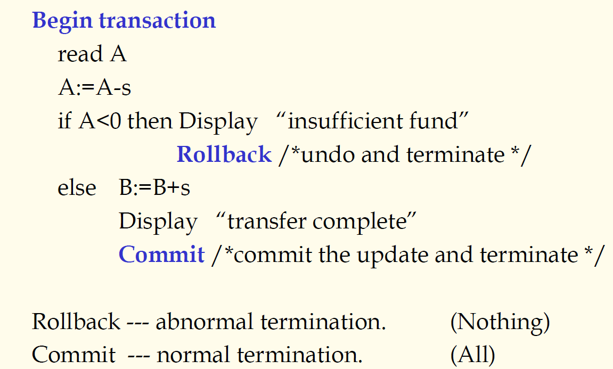
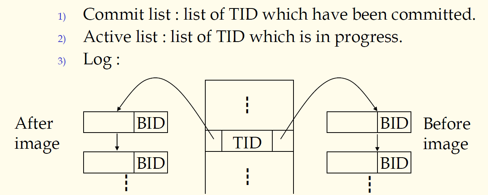

## 数据库原理与应用 第四十二讲 事务与日志

- 作者：**赵明心**
- 日期：**2019年8月20日**

---

### **4.5.2 事务**

一个事务（transaction） $T$实际上是一组有限的动作序列（SQL语句），这组语句具有下面的几个性质：

1. 原子性（Atomic）：这组语句要么全部成功，要么一条也没有做
2. 保持一致性（Consistency preservation）：数据库从一个一致性状态过渡到另一个一致状态
3. 隔离性（Isolation）：在一个多用户数据库系统中，多个用户并发访问，每个事务应该互不干扰，以至于感受不到其他事务的存在，这个和操作系统中进程的隔离性是很相似的
4. 持久性（Durability）：一个事务只要成功完成，那么它对数据库产生的影响应该永久反映在数据库当中

将这四个事务的特性首字母连在一起就构成了事务运行的ACID准则。具有这样一组特性的SQL语句就构成了一个事务。ACID准则有什么用处呢？

举个例子，将一笔钱转账，$S$这笔钱从账号$A$转给账号$B$，那么在数据库当中需要从$A$数据库中减掉$S$的钱，对应在$B$中需要加上这些。如果没有事务机制，只是通过一条条SQL语句执行的话，有可能在执行过程中出现断电，操作只完成了一部分，而无法实现原子性。

但是有了事务机制之后就可以保证原子性。在数据库中可以显式创建一个事务。定义成事务之后DBMS来保证ACID原则。

这个事务在修改期间具有排他性，AB的数据具有暂时的不一致数据存在，所以需要排他修改，当修改完成之后才会释放锁使得其他事务能看到AB。终止方式有两种，一种是回滚rollback，一种是commit。失败了就是回滚，成功了是提交。在一个数据库系统中事务是最基本的运行单位，如果不使用transaction显式定义事务的话，系统缺省地将每条SQL语句作为一个事务运行。

以后遇到需要原子性操作的时候一定要显式创建事务。

### **4.5.3 恢复机制中使用的数据结构**

恢复信息中最重要的是日志，应该存储在非挥发存储器上。像硬盘、闪存等掉电信息不消失的存储器属于非挥发存储。日志等数据结构的信息必须存储在这类存储器上。

- 提交事务列表，每次使用显式创建事务的时候，都会创建一个TID，这个TID组成的列表就是提交事务列表
- 活跃事务列表，系统中正在运行的事务
- Log（日志）

每个事务在日志中会有一个记录，我们有两个链表，一个前向链表一个后向链表，后向链表是更新后的新值的物理块，前向链表是新值对应的物理块。有的DBMS实现的方式不一样，但无论怎样，都需要记录老值和新值的值以及其物理地址。

### **4.5.4 提交规则与先记后写规则**

在恢复的时候，任何一个数据库系统都需要遵循一些规则。

1. 提交规则

A.I必须要写到非挥发介质当中，没有说明一定要写入数据库，写入日志也是可以的

2. 先写后记原则

如果更新策略是直接修改数据库，那么修改之前必须把被修改数据的旧值先记录到日志才可以修改，否则数据会被覆盖。

3. 恢复策略
    1. redo和undo操作需要满足幂等性，如果对某个数据对象进行undo，undo一次和若干次效果一样，同样地对于redo也是一样的，redo一次和redo若干次效果一样。注意这个和我们平时使用的word里面的撤销是不一样的。例如数据库中的某个值旧值是10，当我们修改之后变成20，这时使用undo操作，我们得到的一直是10。
