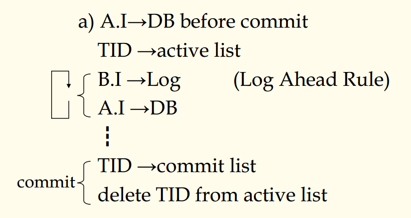
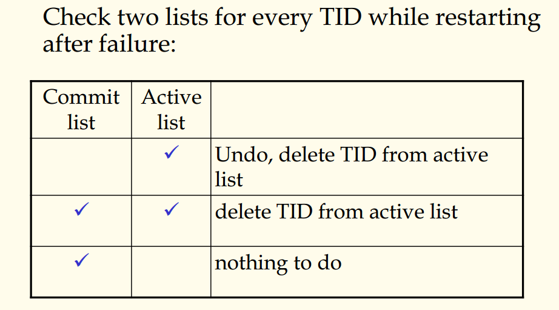
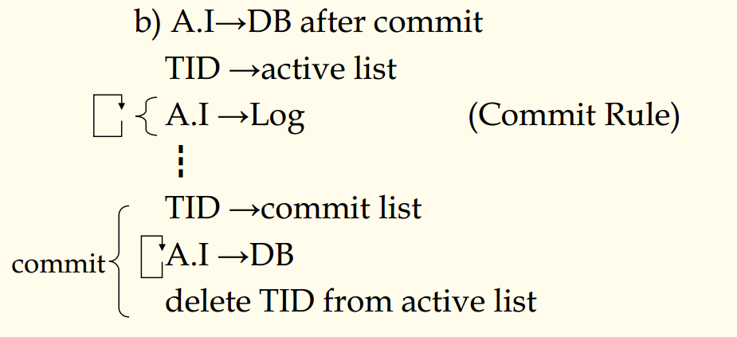
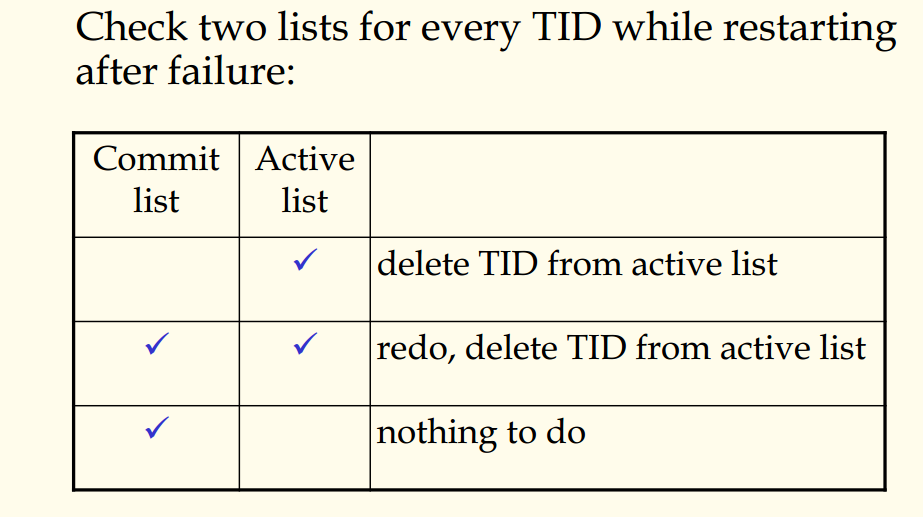
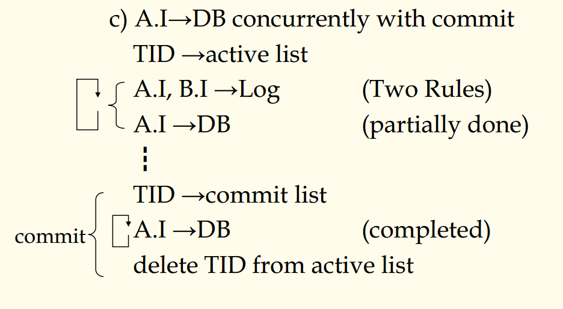

## 数据库原理与应用 第四十三讲 更新策略与恢复机制

- 作者：**赵明心**
- 日期：**2019年8月21日**

---

### **4.5.5 数据库更新的策略**

1. A.I写入DB先于提交

每个更新操作完成事务之后遇到提交命令的时候，实际上做的更新已经改好了，在提交阶段已经没有可做的了，这个时候只需要在活跃列表中删除TID即可。

这样的执行流程如果在某个时刻突然发生故障该如何恢复？在系统中，我们有个流程成为重启动恢复，重启动恢复模块作用是在每次启动的时候检查上次关闭是否是异常退出。也即检查两张表格，检查提交表和活跃表。

当不在提交表而处在活跃表的时候，说明没有正常结束，需要撤销。如果在提交表和活跃表中都出现了TID说明这个事务已经到了最后阶段，这个时候只需要删除对应的活跃表的TID即可。第三种情况就是正常退出。

但是这样还会有问题，一个数据库系统使用时间比较长了以后会有很多事务，如果每次重启动都要检查所有事务的话代价会很大，数据库就引入了检查点的概念。检查点上重启动数据库时，重启动恢复模块只会检查两次检查点中间的运行过的事务TID，然后决定对每个事务需要做什么动作。

第一种故障恢复方式就是利用事务日志进行恢复。

2. 在提交之后将AI写入DB

在确认了事务成功之后再写入数据库，按照这种策略，事务对数据库的修改是当修改了以后先不要写入DB而是记录到日志当中，真正到了提交阶段再修改数据库。这个时候更新才被一个物理块一个物理块地被修改。

采用这种更新策略的系统，发生故障恢复的时候需要做以下的事情：

这种更新策略在讲并发控制封锁协议的时候还会讲，这种更新策略的效率比较高，因为在提交阶段修改数据库可以推迟加排它锁的时机，等到实际写入DB的时候再加排他锁，事务运行的并发度比第一种的效率高。

3. AI与写入DB并发来做

这种更新策略其基本思想是在第二种更新策略的基础之上，在数据库更新时先写入LOG，但是为了充分利用计算机系统的资源，我们知道在一个计算机系统运行了很多程序，由于不同资源的忙闲程度不同，在第二种更新策略基础之上，如果硬盘比较空闲，那么可以安排一个后台线程，见缝插针利用硬盘的空闲时间，将当前记录在LOG中的事务搬运一部分到硬盘上，当存在其他事务需要使用硬盘的时候后台进程马上挂起。

如果一个系统使用这种策略，那么其工作流程是这样的：

