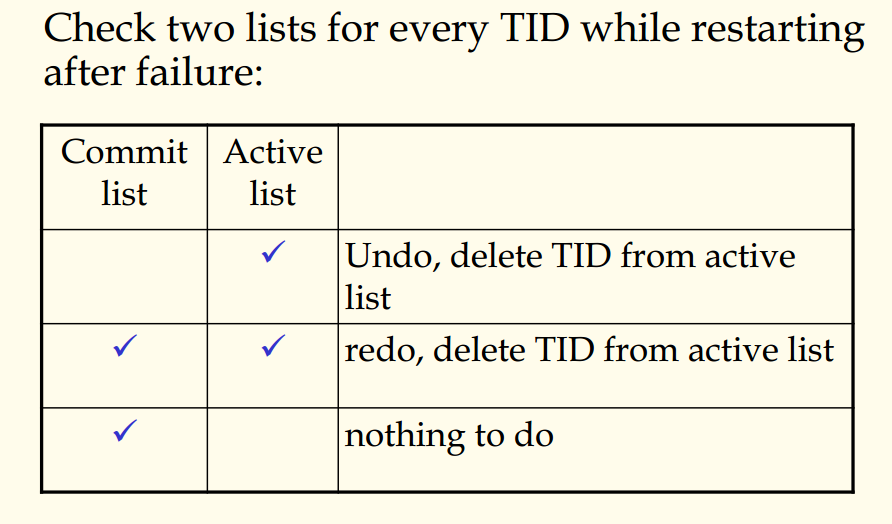

## 数据库原理与应用 第四十四讲 并发控制概述

- 作者：**赵明心**
- 日期：**2019年8月21日**

---

### **4.5.5 更新策略与恢复（续）**

对应于第三种策略，其恢复机制如下：

总结一下，讲了三种更新策略及恢复机制。第一种可能会undo，但不会redo，第二种策略是需要redo但是不会undo，第三种情况是redo和undo都可能需要。

有没有可能存在一种更新策略，当数据库系统运行的时候既不需要redo又不需要undo？有的，异地更新策略的算法是不需要redo和undo的，实际上是采用拨指针的方式。这种方法有个缺点，导致在实际系统中并没有广泛使用，这个需要在课本中仔细看。

## 四（6） 并发控制

所谓并发，是在多用户管理系统中，允许多个用户同时访问数据库，为什么需要并发？
- 改善系统利用率，缩短响应时间，提高效率
- 不同事务访问的可能是数据库中的不同部分，这样并发可以提高利用率

并发执行可能会引发一些问题。

事务任意并发可能引发的问题有：
- 丢失更新，$T1$和$T2$在一起运行，两个事务的语句有可能发生，第一个先读$x$，第一个对$x+1$，第二个做$2*x$，假如$x$初值为4，那么两个运行的时候发生以上调度，那么$x=8$会覆盖$x=3$，如果先做1后做2，结果是10；反之是9。按照这两个事务语句的内容，等于10是对的，等于9也是对的，但是等于8是错的，等于8的时候1号事务对$x$的加1效果没有反映在里面。这就是第一类最严重的问题，由于并发事务对同一个数据进行了**写写冲突**就会对数据更新产生影响。
- 第二个问题是**读脏数据**，当2号事务读了$t$的$x$属性值的时候，恰好1号事务更新了元组$t$，那么2号事务就读到了不对应的$x-y$属性，出现了脏数据。这个会引发恢复时候的错误。如果发生故障的时候1号事务需要回滚，那么这个时候2号事务已经使用了新的$y$值，同样地2号事务也需要滚回，这就造成了恢复时候的多米诺效应。
- 两个事务并发，1号事务一直读取，2号事务在连续两次读取之间对$x$进行了更新，这个时候违反了ACID准则。

这三种问题都是由于并发运行的时候产生了 **写写冲突**、**写读冲突**、**读写冲突**。问题也就两大类，写写冲突和读写冲突。