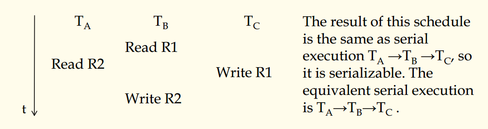
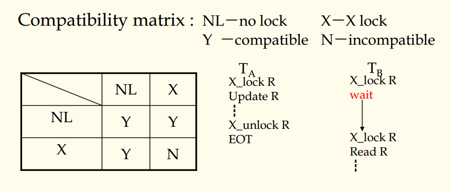

## 数据库原理与应用 第四十五讲 可串行化

- 作者：**赵明心**
- 日期：**2019年8月22日**

---

### **4.6.1 并发运行事务结果是否可串行化**

可串行化用来判断并发运行事务是否可串行化的准则。存在N个事务，系统会产生各种各样地调度，这个和操作系统调度进程是一样的，调度的顺序和系统当时的情况有关，如果并发事务系统产生了调度，按照这个调度运行的时候，系统的运行结果和某个串行执行结果相同的话，我们就认为是可串行化的。

可串行化的定义很简单，但是实际上，N个事务可排列的组合存在$N!$种串行序列，N个事务交给系统并发运行的时候，只需要跟某种串行结果相同的时候就可串行化。是不是这样呢？答案是肯定的。实际上只需要跟$N!$中的任何一个一样就可串行化，这个和我们平常的认知不太一样，我们一般认为做一件事正确结果只能有一个。但是在数据库并行运行的时候结果是可以有很多种的。

为什么这样呢？实际上，以之前的例子，说明用户希望存在并发执行，用户只是不希望得到8这个结果，如果用户只想得到10，而不希望得到9，那么说明用户希望并发执行，产生的结果是可以存在多种的。

并发控制在控制的时候就是控制不出现$x=8$这种情况。下面举个例子说明可串行化：

$TA$和$TB$在$R2$存在冲突，$TB$和$TC$在$R1$存在冲突。下面看具体的并发控制方法。

### **4.6.3 封锁协议（Locking Protocol）**

封锁法是最常用的并发控制方法。这个和操作系统类似，当大家都需要使用打印机的时候，操作系统可以对打印机加锁。利用锁可以解决对同一个数据对象冲突的问题。封锁法要求，对数据对象进行操作的时候必须要申请得到锁，当数据对象之间不存在冲突的时候，就没有影响，当访问的数据对象有冲突的时候，就会出现竞争现象，抢到锁的事务先运行，后抢到的后运行。这强迫了并发运行的事务强行串行化。这就保证了可串行化，到底是哪个串行结果，这个也是随机的。

1. **X锁（排他锁）**

对于读写来说，只有一种类型的锁，所有事务不管读写都申请一种锁，即排他锁。相容矩阵：

这种情况最简单，因为现在只有一种锁。相容矩阵的行表示某一个数据对象上已经有的锁，列表示某个事务希望新申请的锁，NL表示数据对象上没有锁，X表示已经有锁。如果一个事务需要访问某个数据对象，就需要申请锁，这个时候就需要查询相容矩阵，当矩阵对应位置为Y则表示是相容的，为N表示是不相容的。

在不相容的情况下，事务需要等待，在操作系统中相当于需要sleep。两个事务竞争一个锁的时候，总有一个优先抢到锁，这样另一个慢的事务去抢的时候去检查相容矩阵，就会发现上面已经有了锁，慢的事务就进入了等待。一直等到快事务完成了，就释放了锁，这个时候慢进程查询相容矩阵发现可以得到锁，慢的事务进入执行。

这样借助锁使得并发执行的事务强行串行化。