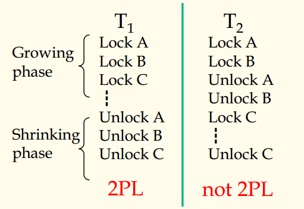
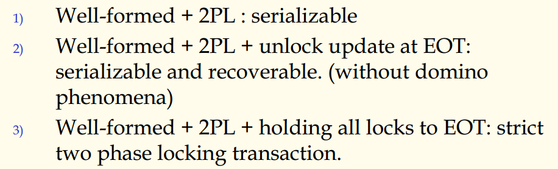
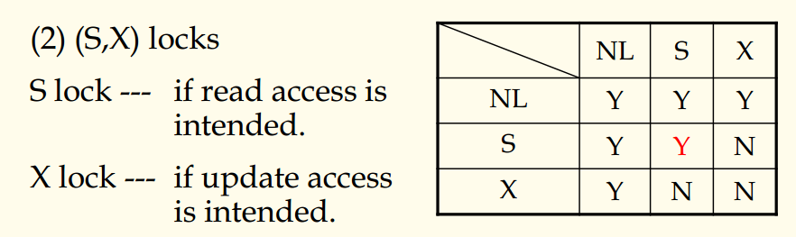

## 数据库原理与应用 第四十六讲 封锁法及其协议

- 作者：**赵明心**
- 日期：**2019年8月22日**

---

### **4.6.3 封锁协议（Locking Protocol）（续）**

几个定义：
- 定义1：在一个事务中，如果所有的锁请求都在所有的锁释放之前，我们就称这样的事务是两阶段事务，这样的限制被称为两阶段锁协议。
- 定义2：在一个事务中，如果它在访问数据对象之前总是先申请锁，那么它就是well-formed的。

在下图中，$T1$是两段加锁，在$T2$就不是两段加锁。第一个阶段是增长阶段，第二个是缩减阶段。一个事务是well-formed，这说明这个事务非常遵守规则，先申请锁再访问数据对象。

- 定理：如果$S$是一组well-formed事务且是2PL的，那么$S$就是可串行化的。

这就是说我们采用封锁法来进行使用并发控制的时候，只要满足以上定理，那么其结果一定是正确的。每个提交的事务只需要保证自己是well-formed且是两阶段的，系统对它们进行调度的时候产生的肯定是可串行化的。当我们使用封锁法来实现并发控制的时候，只要使用这个定理就可以保证结果的正确。定理的证明在课本上，此处略去。（实际证明方法是反证法）

总结：

第二条结论说明了在满足well-formed和2PL的情况下就是可串行化且不会引发多米诺效应。过早释放锁有可能仍然存在多米诺现象。例如一个事务申请了$R$的锁，然后对$R$中的$y$元组进行了写操作，之后释放锁。然后此时有事务$T2$对元组$y$进行某个计算操作，再对元组$z$进行写操作，此时的$T1$和$T2$事务都没有结束，只是释放了锁。与此同时还有第三个事务$T3$，对元组$z$进行了加锁。那么此时需要注意，事务$T1$没有结束，它不再申请新的锁，满足2PL，但是它没有结束，可能还在做别的事情，$T2$也是如此，$T2$还在做别的操作，当它释放了$z$的时候，$T3$可以工作。如果发生了不可预料的错误，导致事务$T1$需要回滚，那么$T1$所做的操作就会滚回，进而导致$T2$也需要滚回，以至于出现多米诺现象。

这个时候如果推迟到事务结束的时候才释放锁的话，就可以保证$T2$拿到锁的时候$T1$已经结束，不会发生滚回，也不会产生多米诺现象。如果不光是写操作的锁，还有其他所有锁都是持续到事务结束才释放锁的话，就是严格的两段加锁协议。

2. **(S，X)锁**

一直加排他锁效率是很低的，所以就有了（S，X）锁，S锁是共享锁，只有进行写操作的时候需要申请X锁，这个时候是

它的效率提高在于可以多个事务同时对一个数据对象进行读写操作。

