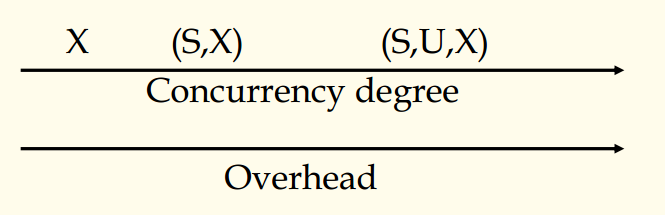

## 数据库原理与应用 第四十七讲 死锁与活锁

- 作者：**赵明心**
- 日期：**2019年8月22日**

---

2. **（S，X）锁（续）**

我们在更新数据的时候一般也要先找到数据，读出来再修改，实际上也不是马上就修改，所以我们对数据对象进行修改的时候，可以不急于加锁，而是先添加一个U锁，读到内存，直到再写回硬盘的时候，再申请X锁，这就产生了U锁。

3. **（S，U，X）锁**

U锁，更新锁，对于一个更新访问，事务先申请一个U锁，然后再申请X锁。这样可以缩短排他性时间，使得并发度提升，减少死锁。注意U锁和U锁是不相容的，不允许两个事务同时以更新的方式去读取一个数据对象。一个事务$T$对数据对象进行更新的时候，先从数据库读取，直到提交的时候再更新数据库。这种方式可以和之前的一种恢复策略结合，申请U锁之后对内存的数据更新得到AI，在提交阶段更新日志并把数据写会硬盘，这个时候申请X锁，避免其他事务读取数据库中的数据。在这个事务进行操作期间，其他事务仍然可以进行读操作。

从并发度和实现代价上，对三种锁协议进行了总结：

### **4.6.4 死锁与活锁**

采用封锁法的系统不可避免地会出现死锁和活锁，这个和操作系统中是一样的，采用锁协议就不可避免地会遇到死锁和活锁。

- 活锁比较简单，只需要调整调度策略，例如产生一个FIFO。
- 死锁有两种解决方案：一种是预防，一种是解决。

#### **死锁检测**

- 超时：只要一个事务的等待时间超过了一定的时间就认为事务发生了死锁，就需要放弃事务。这个需要根据系统的反应时间设置合适的门槛值。不能设置地太小的时间限度，很多事务会重做。
- 检测死锁，正规的事务系统一般采用等待图方法，超时法一般是比较简单的系统才使用。Wait-for $Graph: G=<V,E>$
  - $V$:事务的集合$\{T_i|T_i\ 是DBS中的事务(i=1,2,...n)\}$
  - $E$:$\{<T_i,T_j>|T_i\ wait\ for\ T_j (i\ne j)\}$
  - 等待图顶点是所有事务，边是等待关系
- 如果一个循环出现在图中，那么就出现了死锁
- 什么时候检测呢？
  - 无论什么时候事务出现等待的时候就检测
  - 周期性检测（常用，一个后台线程专门用来检测等待图）
- 当检测到死锁的时候需要做什么？
  - 需要挑选一个牺牲者（有不同的准则，例如锁拥有最少的，最年轻的...）
  - 放弃牺牲者对应的事务，释放它所拥有的锁和资源
  - 授权一个等待者
  - 重启牺牲者（自动或者手动）

#### **死锁避免**