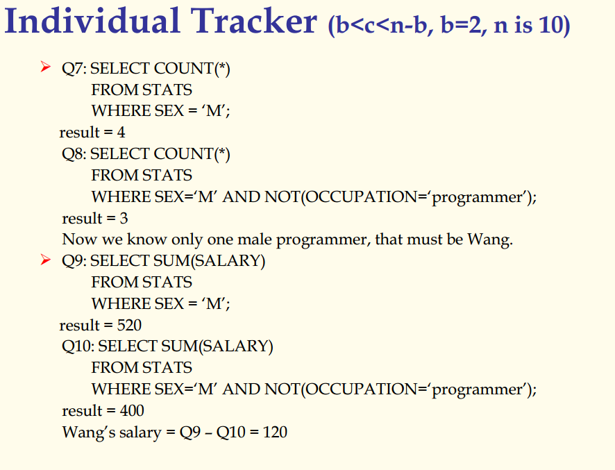

## 数据库原理与应用 第五十讲 统计数据库的安全

- 作者：**赵明心**
- 日期：**2019年8月23日**

---

### 五（1） （续）

有时候一个企业级应用中，有很多很多人使用数据库，例如仓库管理员有很多个，这个时候可以设置仓库管理员角色，所有具有仓库管理员角色的都具有一样的访问权限。

之后还有数据加密，由于DBMS都是建立在操作系统之上的，所以我们必须保证数据访问都需要经过DBMS，而不能绕过DBMS直接从操作系统层去访问。这个在Linux系统中可以实现。尽管有这些限制，仍然不可避免数据被修改，而且在网络环境中，数据仍然可能被暴露和修改，所以对数据安全比较高的系统中，数据会经过加密之后进入磁盘，直接从操作系统打开是无法看到实际数据的。这个更详细的内容在密码相关的课程有讲解。（注意加密、解密会影响数据访问效率）

即便是经过了加密，仍然有被破解的可能，为了保证数据库的安全，即使是出现了事故也可以跟踪和分析数据的安全，数据库还提供了审计追踪功能。在我们关心的对象上可以设置审计追踪，这样在该数据对象上的操作都会被追踪记录下来。以后出现了问题就可以通过审计追踪记录看到之前所做的修改。以上命令相当于对数据库中的emp雇员表格设置了审计追踪，一旦设置了审计追踪，用户对这张表的查询、插入、删除、更新后，在数据库的审计记录中都会记录审计更新信息，就像是日志一样。

### **5.1.1 统计数据库安全**

既然讲到了安全问题，就引出了统计数据库的安全问题。统计数据库中的单个个体的数据是不公开的，但是表中的统计信息是可以查询的，例如可以允许用户查询一些统计信息但是不允许查询单个数据记录。这件事情通过用户身份识别、认证、权限控制还不能完全保证统计信息安全，在统计数据库中可能存在这样的情况，用户根据统计信息反推出一些个体信息。所以需要防止合法用户通过合法手段推算出一些个体信息，这个问题并不容易解决，直到现在也没有很好的解决。

在上面这张表中，可以查询所有程序员的平均工资，或者查询家庭人口数两人以上的平均工资。但是不允许查询特定程序员的工资信息。如何防止推算隐私数据呢？

如果规定了只能做统计查询，不允许出现WHERE NAME=WANG这种语句，但是可以sum\max等等。下面举个例子看怎么借助统计信息反推个人信息。

