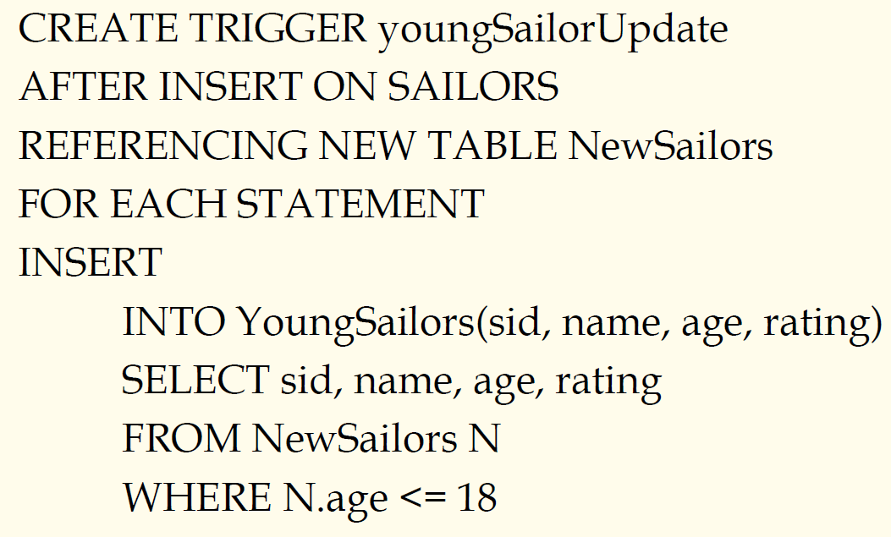

## 数据库原理与应用 第五十三讲 触发器

- 作者：**赵明心**
- 日期：**2019年8月28日**

### **5.1.4 定义约束**

- 在多个关系（表）上面定义约束，有时候需要针对多张表定义约束，加入在游船俱乐部中，水手总数加上船的总数小于100，则为小俱乐部，我们在水手和船表上定义约束，当水手和船总数小于100，就满足条件。牵涉到两个以上表的约束可以使用断言Assertion。单个表的CHECK子句在此处不适用。

加入断言可以保证在水手和船任何一张表中进行了插删改操作的时候都会进行断言检查，保证条件被满足。而CHECK并不会这样。

### **5.1.5 触发器**

数据库中的约束有两大类，一类是静态约束，一类为动态约束，触发器实际要解决的是动态约束。

- Trigger：当DBMS状态发生转换的时候会自动执行的过程

在实际应用中，我们希望存在一些主动操作而不是被动操作，例如当仓库中有一些货物小于特定值的时候就会自动订货并启动订货流程，或者在证券类应用里，当股票的价格波动的时候，系统可以主动采取一些动作。这些需求我们称为**主动数据库**。主动数据库具有一定的主动能力，当数据库数据处在某种状态的时候它可以主动采取一些动作。在 **主动数据库** 中最关键的是可以监测系统的状态，这就依赖于 **规则**。规则需要说明三件事情：①事件（E）②条件（C）③动作（A）。这三个合在一起称为 **ECA规则**。一个主动数据库系统需要支持 **ECA规则**，一旦事件发生，就可以检测条件，之后采取动作。

- 三部分：
  - 事件（激活触发器）
  - 条件
  - 动作

- 一个例子（Trigger定义语法）：

注意，在这里不同的数据库实现触发器的方法不太一样，在SQL-99标准中，触发器是标准之一，Oracle等比较标准的数据库产品是支持SQL-99标准的。

这个触发器监视水手这张表，一旦新插入元组的时候，这个规则查看新插入的水手是不是大于18岁，同时DB维护一张年轻水手表，年轻水手表并不是独立的，年轻水手表中的水手都属于水手表中的元组，我们不会单独操作年轻水手表，而是借助插入水手表时的检查来自动向年轻水手表中插入一个元组，对于删除而言也是一样的。通过这种方式来维持两张表之间的数据一致性。

注意这里触发器触发时间通过BEFORE、AFTER来控制，一旦事件发生了或者发生前进行。数据库中的老值到新值的变换过程称为过渡值，过渡值在触发器定义过程中可能需要引用这个值。REFERENCE这个语句是给过渡值起一个名字，以便于后续使用。我们INSERT的时候，将新插入作为一张表，由于这个例子是插入操作，只有新值，没有老值。我们给新插入的元素去一个名字NewSailors。最下面定义真正的动作，对于每一个INSERT语句，我们做以下动作（也可以写FOR EACH ROW）。有时候满足条件的元组可能不止一条，我们在控制的时候，**ECA规则**控制粒度可以是针对元组，也可以针对整个语句。

